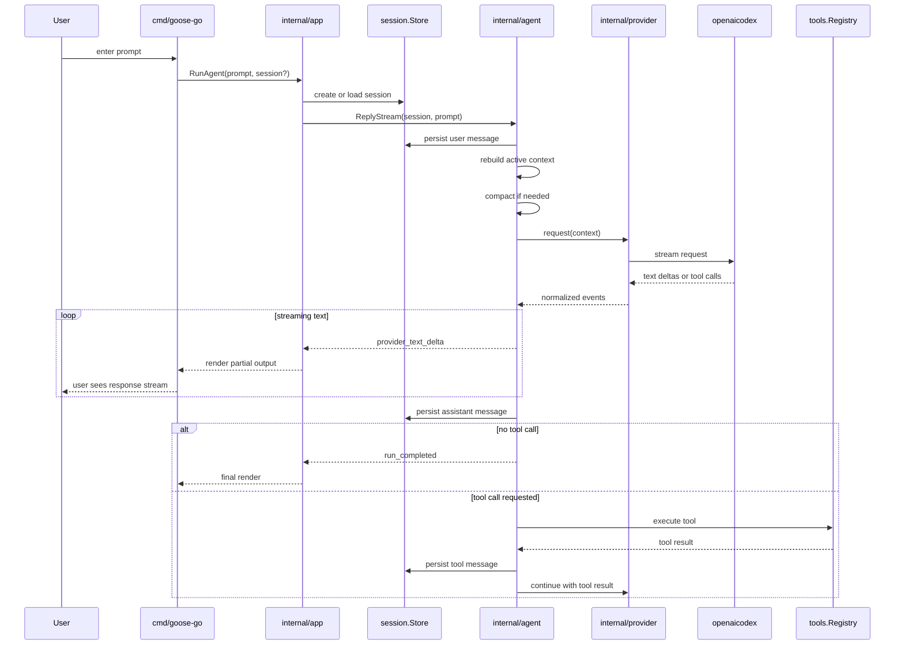

# goose-go

`goose-go` is a Go implementation of Goose terminal core.

The goal is not full product parity with upstream Goose. The first target is a local terminal agent runtime with a structured conversation model, one provider boundary, developer tools, approvals, session persistence, and an end-to-end CLI loop.

## V1 Target

V1 is terminal core only:

- one OpenAI-compatible provider
- structured conversations and sessions
- in-process developer tools
- multi-turn agent loop
- approval flow
- smoke tests and task evals

Not in v1:

- server parity
- desktop parity
- broad provider parity
- remote MCP transport breadth
- full upstream Goose feature parity

## Upstream Reference

The [goose](/Users/rex/projects/goose-go/goose) submodule is the reference implementation. It is read-only in this repo and exists for architecture study, behavior comparison, and implementation notes.

## Repo Map

- [AGENTS.md](/Users/rex/projects/goose-go/AGENTS.md): short navigation guide for agents
- [docs/design-principles.md](/Users/rex/projects/goose-go/docs/design-principles.md): project design rules derived from the agent-first harness approach
- [docs/architecture.md](/Users/rex/projects/goose-go/docs/architecture.md): target package layout and boundaries
- [internal/agent/ARCHITECTURE.md](/Users/rex/projects/goose-go/internal/agent/ARCHITECTURE.md): high-level architecture of the runtime loop and approval flow
- [internal/session/ARCHITECTURE.md](/Users/rex/projects/goose-go/internal/session/ARCHITECTURE.md): session store boundary, summaries, and SQLite relationship
- [internal/tools/ARCHITECTURE.md](/Users/rex/projects/goose-go/internal/tools/ARCHITECTURE.md): high-level architecture of the tool runtime and first concrete tool
- [internal/compaction/ARCHITECTURE.md](/Users/rex/projects/goose-go/internal/compaction/ARCHITECTURE.md): compaction planning layer, cut-point logic, and active-context reconstruction
- [internal/provider/openaicodex/ARCHITECTURE.md](/Users/rex/projects/goose-go/internal/provider/openaicodex/ARCHITECTURE.md): high-level architecture of the first concrete provider
- [internal/evals/ARCHITECTURE.md](/Users/rex/projects/goose-go/internal/evals/ARCHITECTURE.md): deterministic runtime eval harness and trace-based regression model
- [internal/tui/ARCHITECTURE.md](/Users/rex/projects/goose-go/internal/tui/ARCHITECTURE.md): Bubble Tea frontend architecture over the live agent event stream
- [internal/tui/markdown/ARCHITECTURE.md](/Users/rex/projects/goose-go/internal/tui/markdown/ARCHITECTURE.md): inline markdown rendering for assistant/system transcript content
- [internal/tui/theme/ARCHITECTURE.md](/Users/rex/projects/goose-go/internal/tui/theme/ARCHITECTURE.md): semantic TUI theme tokens and built-in dark/light theme model
- [docs/invariants.md](/Users/rex/projects/goose-go/docs/invariants.md): hard rules for the project
- [docs/goose-reference.md](/Users/rex/projects/goose-go/docs/goose-reference.md): what to copy, defer, or ignore from upstream Goose
- [docs/evals.md](/Users/rex/projects/goose-go/docs/evals.md): future smoke and eval strategy
- [progress.md](/Users/rex/projects/goose-go/progress.md): project rollup and milestone status
- `progress/`: milestone-by-milestone implementation tracking

## Prerequisites

This repo is currently set up around:

- Go `1.26.1`
- `golangci-lint` `2.11.2`

Install them with Homebrew:

```sh
brew install go golangci-lint
```

## Workflow

Use the root make targets:

```sh
make run
make test
make lint
make check
make repocheck
make smoke
make eval
```

`make eval` now runs a minimal deterministic trace-based eval suite over scripted runtime scenarios.
`make repocheck` now runs repository hygiene checks over the `goose-go` tree, including oversized-file thresholds and local Markdown link validation.

To prove the current Codex provider path end to end, run:

```sh
go run ./cmd/goose-go provider-smoke
```

This uses the real `openai-codex` provider, reads the existing `codex login` cache, sends a tiny prompt, and streams the result to the terminal.

To inspect the translated request, redacted headers, raw SSE events, and normalized provider events:

```sh
go run ./cmd/goose-go provider-smoke --debug
```

`provider-smoke` now reports normalized failure categories such as:

- `auth_missing`
- `auth_invalid`
- `auth_refresh_failed`
- `provider_request_failed`
- `provider_http_error`
- `provider_stream_error`
- `provider_empty_response`

Use `--debug` when you need the low-level cause appended to the concise diagnostic.

The main `goose-go run` path now uses the same diagnostic model for provider/auth failures.

To run the first real agent loop from the CLI:

```sh
go run ./cmd/goose-go run "list my home directory"
```

To ask the runtime which provider/model is configured without hitting the provider:

```sh
go run ./cmd/goose-go run "/model"
```

Shell tool execution now requires approval by default in both `goose-go run` and `goose-go tui`.

For CLI `run`, inline terminal approval prompts are enabled by default. To disable the inline prompt and allow the run to pause instead, use:

```sh
go run ./cmd/goose-go run --approve=false "list my home directory"
```

To list stored sessions:

```sh
go run ./cmd/goose-go sessions
```

To resume an existing session:

```sh
go run ./cmd/goose-go run --session <session-id> "continue from here"
```

To open the Stage 1 TUI:

```sh
go run ./cmd/goose-go tui
go run ./cmd/goose-go tui --theme light
go run ./cmd/goose-go tui --session <session-id>
```

Inside the TUI, `/model` opens the registry-backed model picker, `/theme` opens the built-in theme picker, `/sessions` opens the recent-session picker, `/session` reports current session metadata, `/new` resets to a fresh session state, and `/help` lists the local commands.
`goose-go run` cancels cleanly on `Ctrl-C`, writes per-session JSONL traces under `.goose-go/traces/`, and shares the same runtime/session path as the TUI.

## TUI Manual Test Runbook

1. Start the TUI:
```sh
go run ./cmd/goose-go tui
```
- Verify the Bubble Tea screen opens with `session: new` and `status: idle`.

2. Submit a simple prompt:
```text
Reply with the single word: pong
```
- Verify status moves through `starting` to `running` to `completed`, and the response streams into the transcript.

3. Exercise tool activity:
```text
Use the shell tool to run 'pwd' and explain the result.
```
Verify:
- transcript shows one grouped `tool[...]` block
- the block includes args, status, and final output
- final assistant response appears after the tool result

4. Exercise interrupt:
```text
Use the shell tool to run 'sleep 10 && echo done'
```
Then press `Ctrl-C` or `Esc`.
Verify:
- status changes to `interrupting`
- transcript shows `interrupted`
- the TUI stays open

5. Exercise resume:
```sh
go run ./cmd/goose-go tui --session <session-id>
```
Verify:
- prior transcript is replayed on startup
- new prompts continue the same session

6. Inspect the trace:
```sh
ls .goose-go/traces
jq . .goose-go/traces/<session-id>.jsonl
```
- the TUI run produced the same normalized runtime event trace as `goose-go run`

7. Exercise approval in the TUI:
```text
Use the shell tool to run 'pwd' and explain the result.
```
Verify:
- an approval panel opens inside the TUI by default for shell execution
- `a` or `y` approves and continues the run
- `d` or `n` denies and keeps the run inside the TUI
8. Exercise model selection in the TUI:
```text
/model
```
Verify:
- a model picker opens with the current model preselected
- unavailable models remain visible with a reason
- pressing `Enter` on an available model updates the active runtime selection
9. Exercise session selection in the TUI:
```text
/sessions
```
Or press `Ctrl-R`.
- a recent-session picker opens inside the TUI, selecting a session replays its transcript, and the resumed session adopts its persisted provider/model through the shared runtime path
10. Exercise the local command surface in the TUI:
```text
/help
/theme
/session
/debug
/new
```
- Verify `/help` lists commands, `/theme` opens the built-in theme picker, `/session` reports metadata, `/debug` toggles debug mode, and `/new` resets the interactive state.
11. Exercise transcript history scrolling in the TUI:
- use `PageUp` / `PageDown` and `Home` / `End`; while scrolled up, verify new assistant or tool output does not force the viewport back to the bottom
12. Exercise terminal copy behavior in the TUI:
- highlight transcript text directly with the mouse and copy it using normal terminal selection shortcuts
12. Start the TUI with debug mode immediately: `go run ./cmd/goose-go tui --debug`
## How A Run Works

At a high level, one CLI run now follows this path:



This is the current runtime shape, not a future-state sketch: the CLI renders from the live agent event stream, sessions persist at each step, and tool execution can trigger another provider turn before the run completes.
## Current State

The repo now has the first runtime foundation in place:

- root docs and progress tracking are set up
- design principles for future feature work are documented at the root
- structured conversation types exist
- a SQLite-backed session store exists with tests for create, load, append, replace, and replay
- a real `openai-codex` provider exists with a minimal runtime smoke path
- an `internal/agent` loop exists for multi-turn replies, tool dispatch, max-turn limits, approval handling, and live event streaming
- `goose-go run` now renders from that live event stream instead of waiting for a completed transcript
- `goose-go run` can list, resume, and interrupt persisted sessions cleanly
- per-session JSONL traces are written from the same event stream used for terminal rendering
- context compaction is integrated into the agent loop and persisted through the session/store boundary
- `make eval` runs a first deterministic trace-based runtime eval suite

Milestone 06 is now complete: the event-stream and hardening layer is in place, including interrupt handling, per-session event traces, compaction, eval coverage, architecture checks, and repository hygiene checks. Milestone 07 is now in progress with the initial Bubble Tea TUI scaffold under `internal/tui` and `cmd/goose-go tui`.
