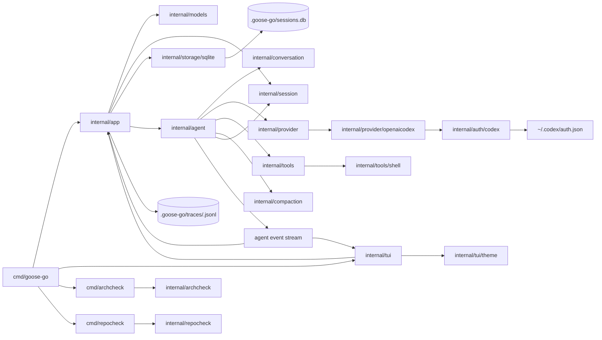
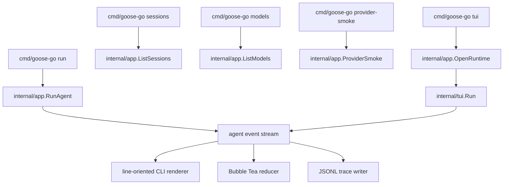

# Architecture

`goose-go` is a Go reimplementation of the terminal-core Goose runtime. The initial target is a local terminal agent that can hold structured conversations, call tools, persist sessions, and run a coding loop through one provider.

## Design Goal

The root repo should act as the system of record for both humans and agents. The implementation should stay narrow, legible, and easy to evaluate end to end.

## Target Package Layout

These packages define the intended shape of the system. They are architectural targets, not a requirement that all directories exist yet.

- `cmd/goose-go`
  CLI entrypoint only.
- `cmd/archcheck`
  Thin CLI wrapper for mechanical architecture-boundary checks.
- `cmd/repocheck`
  Thin CLI wrapper for repo hygiene checks.
- `internal/app`
  Runtime composition, CLI-facing flows, diagnostics, trace writing, and shared startup/runtime selection.
- `internal/agent`
  Turn loop, orchestration, retries, approval flow, compaction hooks.
- `internal/compaction`
  Token budgeting, cut-point planning, summary generation, and active-context reconstruction.
- `internal/models`
  Built-in provider/model catalog, availability filtering, and runtime selection helpers.
- `internal/conversation`
  Message types, tool call/result types, conversation state, serialization.
- `internal/provider`
  Provider interface, model config, streaming adapters, one OpenAI-compatible implementation first.
- `internal/auth`
  Auth readers and refresh logic for external credential sources such as Codex subscription state.
- `internal/tools`
  Tool registry, tool contracts, and first-party developer tools such as `shell`, `write`, `edit`, and `tree`.
- `internal/session`
  Session types, store contracts, resume/replay semantics, token/accounting metadata.
- `internal/storage`
  Persistence implementations such as SQLite, including schema and migrations.
- `internal/archcheck`
  Reusable architecture-check rules and package-boundary validation.
- `internal/repocheck`
  Repo hygiene checks such as oversized-file and Markdown-link validation.
- `internal/prompt`
  System prompt builder, local hint loading, prompt composition.
- `internal/config`
  Config loading, secrets, run modes, permission settings.
- `internal/evals`
  Smoke tests, task evals, regression harness.
- `internal/tui`
  Bubble Tea frontend, event adapter, terminal-native transcript printing, and interactive terminal rendering.
- `internal/tui/markdown`
  Inline markdown rendering for assistant/system transcript content, with width-aware styled wrapping.
- `internal/tui/theme`
  Semantic TUI theme tokens, built-in themes, and theme selection helpers.

## Layer Boundaries

- `app` composes runtime pieces. It should not absorb provider internals, tool execution internals, or UI state logic.
- `agent` orchestrates. It should not embed provider-specific HTTP logic or low-level persistence details.
- `compaction` plans and summarizes context. It should not own session persistence or UI behavior.
- `models` defines selectable runtime identity. It should not know about TUI widgets or provider HTTP details.
- `provider` talks to models. It should not execute tools or manage sessions.
- `tools` executes tool logic. It should not know about provider request formats.
- `session` persists state. It should not own agent orchestration rules.
- `tui` renders and collects terminal interaction. It should not contain core agent logic.

These boundaries are now partially enforced by [internal/archcheck/check.go](/Users/rex/projects/goose-go/internal/archcheck/check.go) and [internal/archcheck/rules.go](/Users/rex/projects/goose-go/internal/archcheck/rules.go), with [cmd/archcheck/main.go](/Users/rex/projects/goose-go/cmd/archcheck/main.go) acting as a thin CLI wrapper:

- production packages may not depend on `cmd/*`
- production packages may not depend on `internal/evals`
- `internal/auth` may not depend on app, agent, provider, session, storage, or tools
- `internal/provider/openaicodex` may not depend on app, agent, session, storage, or tools
- `internal/storage/sqlite` may not depend on app, agent, auth, provider, or tools
- `internal/evals` is kept off the app-layer composition path on purpose

## System Diagram

This reflects the current system shape:

- `cmd/goose-go` owns the user-facing entry surfaces, while `internal/app` owns shared runtime composition.
- `internal/models` is now the source of truth for provider/model selection and availability filtering.
- `internal/agent` is the runtime control plane.
- `session.Store` is the persistence seam used by both app and agent.
- `internal/compaction` is a real runtime subsystem behind the agent loop, not just future scaffolding.
- provider, tools, auth, and storage stay behind their package boundaries.
- `internal/prompt` now owns base run-prompt composition and eager `AGENTS.md` loading instead of leaving system prompt assembly in `internal/app`.
- `internal/agent` owns the live event stream that both `run` and `tui` consume today.
- `cmd/goose-go run` now renders from that stream through `internal/app`, rather than waiting for a completed transcript.
- `cmd/goose-go tui` now uses the same `internal/app.OpenRuntime` path and consumes `ReplyStream(...)` through `internal/tui`.
- `internal/app` records that stream into per-session trace artifacts and owns the normalized diagnostic model for provider/auth failures.
- `internal/tui/theme` is now a concrete subsystem used by the Bubble Tea frontend, not just a styling detail.

## Current Entry Surfaces

This is the current concrete shape:

- `run` is the line-oriented CLI over the event stream
- `models` is the registry-backed listing surface for selectable runtime identity
- `provider-smoke` is the narrow provider-diagnostics surface over the same model/provider configuration path
- `tui` is the Bubble Tea frontend over the same runtime and event stream
- both `run` and `tui` reuse the same provider, tool, session, trace, approval, and compaction behavior

## Concrete Subsystem Docs

The root architecture doc defines package-level boundaries. Concrete subsystem behavior is documented separately:

- [internal/provider/openaicodex/ARCHITECTURE.md](/Users/rex/projects/goose-go/internal/provider/openaicodex/ARCHITECTURE.md): first Codex subscription provider, request translation, auth flow, and SSE normalization
- [internal/agent/ARCHITECTURE.md](/Users/rex/projects/goose-go/internal/agent/ARCHITECTURE.md): multi-turn runtime loop, tool orchestration, and approval flow
- [internal/compaction/ARCHITECTURE.md](/Users/rex/projects/goose-go/internal/compaction/ARCHITECTURE.md): compaction planning, cut-point selection, and active-context reconstruction
- [internal/session/ARCHITECTURE.md](/Users/rex/projects/goose-go/internal/session/ARCHITECTURE.md): session store contract, summaries, and SQLite boundary
- [internal/tools/ARCHITECTURE.md](/Users/rex/projects/goose-go/internal/tools/ARCHITECTURE.md): tool contract, registry, execution flow, and the first concrete `shell` tool
- [internal/prompt/ARCHITECTURE.md](/Users/rex/projects/goose-go/internal/prompt/ARCHITECTURE.md): base system prompt composition and local `AGENTS.md` loading
- [internal/evals/ARCHITECTURE.md](/Users/rex/projects/goose-go/internal/evals/ARCHITECTURE.md): deterministic eval harness over real runtime boundaries and trace assertions
- [internal/tui/ARCHITECTURE.md](/Users/rex/projects/goose-go/internal/tui/ARCHITECTURE.md): Bubble Tea frontend, runtime bridge, and terminal-native scrollback model over the live agent event stream
- [internal/tui/markdown/ARCHITECTURE.md](/Users/rex/projects/goose-go/internal/tui/markdown/ARCHITECTURE.md): inline markdown rendering for assistant/system transcript content
- [internal/tui/theme/ARCHITECTURE.md](/Users/rex/projects/goose-go/internal/tui/theme/ARCHITECTURE.md): semantic TUI theme tokens, built-in dark/light palettes, and theme selection boundaries

## Initial Runtime Scope

The first implementation target is terminal core only:

- one provider
- structured conversation model
- local session persistence
- in-process developer tools
- approval modes
- multi-turn agent loop
- smoke tests and task evals

Not part of the first target:

- desktop UI parity
- server parity
- broad provider parity
- remote MCP transport breadth
- subagents and recipe breadth
