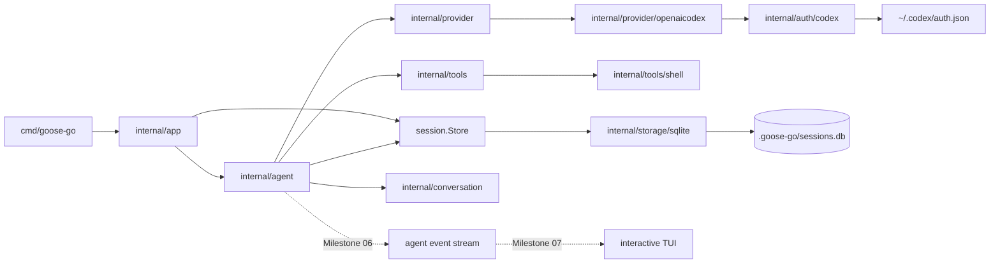

# Architecture

`goose-go` is a Go reimplementation of the terminal-core Goose runtime. The initial target is a local terminal agent that can hold structured conversations, call tools, persist sessions, and run a coding loop through one provider.

## Design Goal

The root repo should act as the system of record for both humans and agents. The implementation should stay narrow, legible, and easy to evaluate end to end.

## Target Package Layout

These packages define the intended shape of the system. They are architectural targets, not a requirement that all directories exist yet.

- `cmd/goose-go`
  CLI entrypoint only.
- `internal/agent`
  Turn loop, orchestration, retries, approval flow, compaction hooks.
- `internal/conversation`
  Message types, tool call/result types, conversation state, serialization.
- `internal/provider`
  Provider interface, model config, streaming adapters, one OpenAI-compatible implementation first.
- `internal/auth`
  Auth readers and refresh logic for external credential sources such as Codex subscription state.
- `internal/tools`
  Tool registry, tool contracts, and first-party developer tools such as `shell`, `write`, `edit`, and `tree`.
- `internal/session`
  Session types, store contracts, resume/replay semantics, token/accounting metadata.
- `internal/storage`
  Persistence implementations such as SQLite, including schema and migrations.
- `internal/prompt`
  System prompt builder, local hint loading, prompt composition.
- `internal/config`
  Config loading, secrets, run modes, permission settings.
- `internal/evals`
  Smoke tests, task evals, regression harness.

## Layer Boundaries

- `agent` orchestrates. It should not embed provider-specific HTTP logic or low-level persistence details.
- `provider` talks to models. It should not execute tools or manage sessions.
- `tools` executes tool logic. It should not know about provider request formats.
- `session` persists state. It should not own agent orchestration rules.
- `cli` renders and collects terminal interaction. It should not contain core agent logic.

## System Diagram

This reflects the current system shape:

- `cmd/goose-go` and `internal/app` own process-level CLI behavior.
- `internal/agent` is the runtime control plane.
- `session.Store` is the persistence seam used by both app and agent.
- provider, tools, auth, and storage stay behind their package boundaries.
- `internal/agent` now owns a live event stream that both CLI and future TUI layers can consume.
- the next architecture step is to make CLI rendering subscribe to that stream directly instead of printing only after completion.

## Concrete Subsystem Docs

The root architecture doc defines package-level boundaries. Concrete subsystem behavior is documented separately:

- [internal/provider/openaicodex/ARCHITECTURE.md](/Users/rex/projects/goose-go/internal/provider/openaicodex/ARCHITECTURE.md): first Codex subscription provider, request translation, auth flow, and SSE normalization
- [internal/agent/ARCHITECTURE.md](/Users/rex/projects/goose-go/internal/agent/ARCHITECTURE.md): multi-turn runtime loop, tool orchestration, and approval flow
- [internal/session/ARCHITECTURE.md](/Users/rex/projects/goose-go/internal/session/ARCHITECTURE.md): session store contract, summaries, and SQLite boundary
- [internal/tools/ARCHITECTURE.md](/Users/rex/projects/goose-go/internal/tools/ARCHITECTURE.md): tool contract, registry, execution flow, and the first concrete `shell` tool

## Initial Runtime Scope

The first implementation target is terminal core only:

- one provider
- structured conversation model
- local session persistence
- in-process developer tools
- approval modes
- multi-turn agent loop
- smoke tests and task evals

Not part of the first target:

- desktop UI parity
- server parity
- broad provider parity
- remote MCP transport breadth
- subagents and recipe breadth
