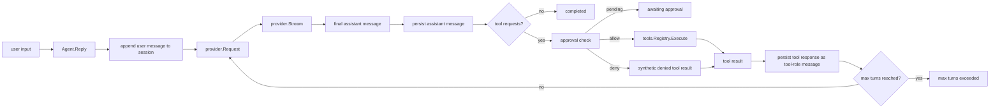
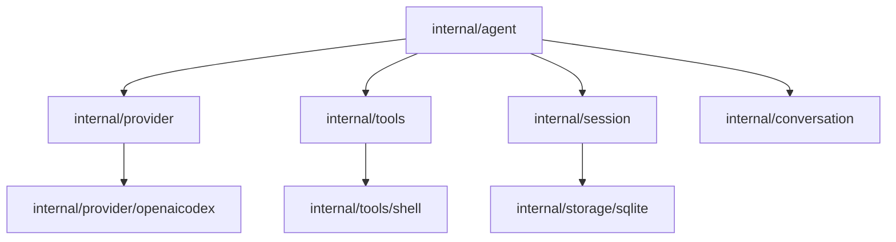

# Agent Architecture

`internal/agent` is the orchestration layer for the terminal-core runtime.

It ties together:

- the session store
- the provider boundary
- the tool registry
- approval handling
- the multi-turn reply loop

The package exists so provider, tools, and persistence stay narrow while one place owns runtime control flow.

## Package Position

`internal/agent` depends on normalized runtime boundaries:

- `internal/session`
- `internal/provider`
- `internal/tools`
- `internal/conversation`

It must not absorb provider HTTP logic, tool implementation details, or storage-specific schema logic.

## Runtime Flow

## Package Topology

## Core Types

- `Agent`
  The orchestrator. It owns one provider, one session store, one tool registry, and one runtime config.
- `Config`
  Runtime settings for system prompt, model choice, max turns, and approval mode.
- `Result`
  The terminal state of one reply operation: completed or awaiting approval, with the updated session.
- `Approver`
  Optional callback boundary for `approve` mode.
- `ApprovalRequest`
  The normalized approval payload for a pending tool call.

## Current Behavior

The first loop is intentionally narrow:

- one provider request per turn
- one final assistant message per provider turn
- tool calls are read from normalized assistant message content
- tool responses are persisted as `tool` role messages
- approval modes are limited to `auto` and `approve`
- max-turn stopping is enforced by the loop

This is enough to support:

- plain assistant replies
- tool request -> tool execution -> follow-up reply
- approval pause when no approver is present
- deny branch through a synthetic tool result

## Why Tool Responses Use `tool` Role

Tool responses are stored as `tool` role messages instead of assistant messages because the provider translation layer already expects tool outputs as a separate message class.

That keeps the agent loop simple:

- assistant emits tool request
- tools layer produces tool result
- session stores tool result as a `tool` role message
- provider reconstructs function-call output on the next turn

## Boundary Rules

- `internal/agent` owns orchestration, not transport details.
- `internal/agent` must only depend on normalized provider and tool contracts.
- Approval logic belongs here, not in CLI rendering or provider code.
- Tool execution must go through the registry, not through direct tool-specific calls.
- Session persistence must stay behind the `session.Store` contract.

## Near-Term Growth

The next layer is Milestone 05: expose this loop through the CLI.

That means:

- creating or loading sessions from `cmd/goose-go`
- rendering streamed output to the terminal
- surfacing approval pauses to the user
- handling interrupts and resume

The goal is to keep that CLI layer thin. `internal/agent` should remain the only runtime orchestration layer.
