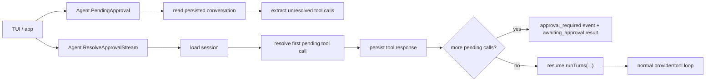
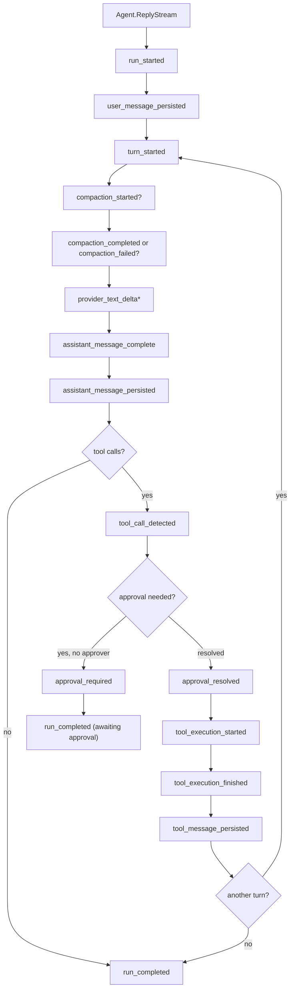
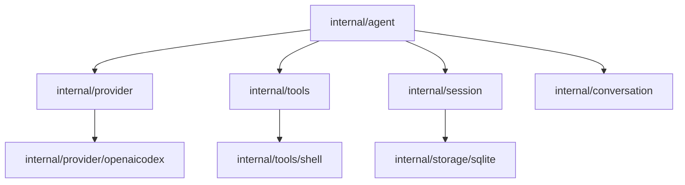

# Agent Architecture

`internal/agent` is the orchestration layer for the terminal-core runtime.

It ties together:

- the session store
- the provider boundary
- the tool registry
- approval handling
- approval continuation for paused runs
- the multi-turn reply loop
- the live event stream used by CLI and future TUI layers

The package exists so provider, tools, and persistence stay narrow while one place owns runtime control flow.

## Package Position

`internal/agent` depends on normalized runtime boundaries:

- `internal/session`
- `internal/provider`
- `internal/tools`
- `internal/conversation`

It must not absorb provider HTTP logic, tool implementation details, or storage-specific schema logic.

## Runtime Flow

```mermaid
flowchart LR
    A["cmd/goose-go run"] --> B["internal/app.RunAgent"]
    B --> C["Agent.Reply"]
    C --> D["Agent.ReplyStream"]
    D --> E["append user message to session"]
    E --> F["rebuild active context"]
    F --> G{"compaction needed?"}
    G -- "yes" --> H["summarize older context + persist compaction"]
    G -- "no" --> I["provider.Request"]
    H --> I
    I --> J["provider.Stream"]
    J --> K["emit provider_text_delta events"]
    J --> L["final assistant message"]
    L --> M["persist assistant message"]
    M --> N{"tool requests?"}

    N -- "no" --> O["run_completed event"]
    N -- "yes" --> P["approval check"]

    P -- "pending" --> Q["approval_required event"]
    P -- "deny" --> R["synthetic denied tool result"]
    P -- "allow" --> S["tools.Registry.Execute"]

    S --> T["tool result"]
    R --> T
    T --> U["persist tool response as tool-role message"]
    U --> V{"max turns reached?"}
    V -- "no" --> F
    V -- "yes" --> W["run_failed event (max turns)"]
```

## Approval Continuation Flow

`ReplyStream(...)` handles fresh user input. `ResolveApprovalStream(...)` resumes a paused run from persisted conversation state after a tool approval decision is supplied.

## Event Stream Flow

## Package Topology

## Core Types

- `Agent`
  The orchestrator. It owns one provider, one session store, one tool registry, and one runtime config.
- `Config`
  Runtime settings for system prompt, model choice, max turns, and approval mode.
- `Result`
  The terminal state of one reply operation: completed or awaiting approval, with the updated session.
- `Event`
  The normalized live runtime fact emitted by `ReplyStream`.
- `Approver`
  Optional callback boundary for `approve` mode.
- `ApprovalRequest`
  The normalized approval payload for a pending tool call.

## Current Behavior

The first loop is intentionally narrow:

- one provider request per turn
- one final assistant message per provider turn
- tool calls are read from normalized assistant message content
- tool responses are persisted as `tool` role messages
- approval modes are limited to `auto` and `approve`
- paused approval runs can now be resumed through explicit continuation APIs without inventing UI-owned runtime state
- max-turn stopping is enforced by the loop

This is enough to support:

- plain assistant replies
- tool request -> tool execution -> follow-up reply
- approval pause when no approver is present
- deny branch through a synthetic tool result
- default shell execution in the persisted session working directory when the model omits `working_dir`
- threshold compaction before provider turns when the active context estimate exceeds the configured budget
- one overflow-recovery compaction attempt when the provider reports a context-length failure
- live runtime observation without reading SQLite directly

## Event Taxonomy

The current event set is intentionally narrow:

- `run_started`
- `user_message_persisted`
- `turn_started`
- `provider_text_delta`
- `assistant_message_complete`
- `assistant_message_persisted`
- `tool_call_detected`
- `approval_required`
- `approval_resolved`
- `tool_execution_started`
- `tool_execution_finished`
- `tool_message_persisted`
- `compaction_started`
- `compaction_completed`
- `compaction_failed`
- `run_completed`
- `run_interrupted`
- `run_failed`

These are runtime facts, not provider wire events. The provider still handles SSE internally; the agent exposes normalized milestones the CLI and future TUI can render safely.

## Why Tool Responses Use `tool` Role

Tool responses are stored as `tool` role messages instead of assistant messages because the provider translation layer already expects tool outputs as a separate message class.

That keeps the agent loop simple:

- assistant emits tool request
- tools layer produces tool result
- session stores tool result as a `tool` role message
- provider reconstructs function-call output on the next turn

## Boundary Rules

- `internal/agent` owns orchestration, not transport details.
- `internal/agent` must only depend on normalized provider and tool contracts.
- Approval logic belongs here, not in CLI rendering or provider code.
- Tool execution must go through the registry, not through direct tool-specific calls.
- Session persistence must stay behind the `session.Store` contract.

## Near-Term Growth

Milestone 05 is now in place:

- `cmd/goose-go run` exposes the runtime through a thin app layer
- sessions can be listed and resumed
- `SIGINT` cancels the active run cleanly

The next architecture step is Milestone 06:

- keep growing the event stream into the primary live runtime interface
- keep CLI rendering on top of the event stream instead of transcript-after-completion output
- feed trace/log sinks from the same event stream so runs stay debuggable after the terminal output is gone
- make live rendering and future TUI work subscribe to agent events instead of polling persistence

`internal/agent` should remain the only runtime orchestration layer even after event streaming lands.
