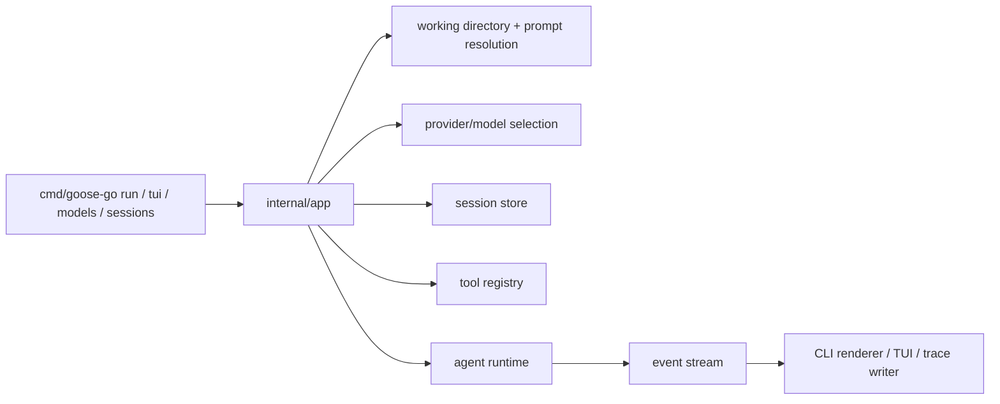

# App Architecture

`internal/app` is the runtime composition layer for `goose-go`.

It turns CLI- and TUI-facing intents into a configured runtime without letting entrypoints absorb provider, storage, or tool wiring.

## Code Map

- `Runtime`
  Long-lived composed runtime handle used by both CLI and TUI surfaces.
- runtime opening
  Resolves working directory, provider/model selection, session store, tools, prompt, and agent config.
- run-facing helpers
  Thin flows for `run`, `sessions`, `models`, provider smoke, and trace recording.
- diagnostics
  Normalizes provider/auth failures into stable user-facing categories.
- context snapshot
  Exposes an inspectable view of the active session context without pushing UI code into agent or storage packages.

## Composition Flow

## Boundaries

- `internal/app` may compose runtime packages and expose thin user-surface helpers.
- `internal/app` must not own provider wire formats, SQLite queries, or tool implementation logic.
- CLI and TUI entrypoints should stay thin and delegate shared behavior here.
- User-facing diagnostics belong here rather than inside provider implementations.

## Cross-Cutting Concerns

- selection: the app layer is where default provider/model resolution becomes a concrete runtime choice
- diagnostics: low-level provider/auth failures are mapped here into stable categories for CLI users
- traces: run surfaces record normalized agent events through the same app-owned trace path
- prompt context: prompt assembly stays centralized here through `internal/prompt`, so user surfaces do not drift

## Current Constraints

- the current composition path still hardcodes the first provider and first-party tool set
- model/provider selection is registry-backed, but provider instantiation is still intentionally narrow
- `internal/app` should stay a thin adapter layer, not a second orchestration layer beside `internal/agent`
