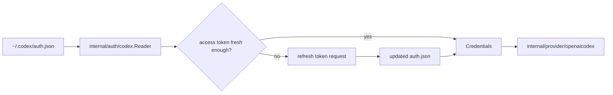

# Codex Auth Architecture

`internal/auth/codex` is the credential-reader boundary for the first provider slice.

It translates the local Codex auth cache into normalized credentials that provider code can use without learning the auth-file format directly.

## Code Map

- `Reader`
  Loads, validates, refreshes, and rewrites the local Codex auth state.
- `Credentials`
  Normalized output passed to provider code.
- auth-file parsing
  Decodes the local cache format and extracts account identity and token claims.
- refresh flow
  Exchanges the refresh token for a new access token when the cached token is near expiry.

## Credential Flow

## Boundaries

- this package owns auth-file parsing and refresh logic for Codex credentials
- it must not know about provider request bodies, agent orchestration, sessions, tools, or UI state
- provider code should depend on normalized `Credentials`, not on auth-file JSON shape

## Cross-Cutting Concerns

- failure normalization: this package returns concrete causes that the app layer later maps into stable diagnostics
- local state updates: refresh mutates the on-disk auth cache, so file format handling must stay centralized here
- security: credentials stay file-backed and process-local in the current slice

## Current Constraints

- only the current file-backed Codex login cache is supported
- keyring-backed auth and broader login flows are intentionally deferred
