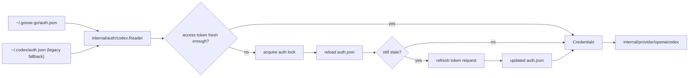

# Codex Auth Architecture

`internal/auth/codex` is the credential-reader boundary for the first provider slice.

It translates the local Codex auth cache into normalized credentials that provider code can use without learning the auth-file format directly.

## Code Map

- `Reader`
  Loads, validates, refreshes, locks, and rewrites the local Codex auth state.
- `Credentials`
  Normalized output passed to provider code.
- auth-file parsing
  Decodes the local cache format and extracts account identity and token claims.
- refresh flow
  Exchanges the refresh token for a new access token when the cached token is near expiry.
- lock manager
  Serializes refresh/write access to the shared auth cache so multiple `goose-go` processes do not race.

## Credential Flow

```mermaid
flowchart LR
    A["~/.goose-go/auth.json"] --> B["internal/auth/codex.Reader"]
    A2["~/.codex/auth.json (legacy fallback)"] --> B
    B --> C{"access token fresh enough?"}
    C -- "yes" --> D["Credentials"]
    C -- "no" --> E["acquire auth lock"]
    E --> F["reload auth.json"]
    F --> G{"still stale?"}
    G -- "no" --> D
    G -- "yes" --> H["refresh token request"]
    H --> I["updated auth.json"]
    I --> D
    D --> J["internal/provider/openaicodex"]
```

## Boundaries

- this package owns auth-file parsing and refresh logic for Codex credentials
- it must not know about provider request bodies, agent orchestration, sessions, tools, or UI state
- provider code should depend on normalized `Credentials`, not on auth-file JSON shape

## Cross-Cutting Concerns

- failure normalization: this package returns concrete causes that the app layer later maps into stable diagnostics
- local state updates: refresh mutates the on-disk auth cache, so file format handling must stay centralized here
- cross-process coordination: refresh is guarded by a lock file and re-checks disk after lock acquisition
- security: credentials stay file-backed and process-local in the current slice

## Current Constraints

- native `goose-go login` writes the preferred file-backed Codex cache at `~/.goose-go/auth.json`
- the legacy `~/.codex/auth.json` cache remains a compatibility fallback
- keyring-backed auth and broader login flows are intentionally deferred
- refresh-failure recovery prefers reloading disk state before failing, so another process can win the refresh race safely
