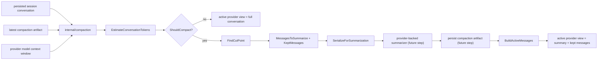
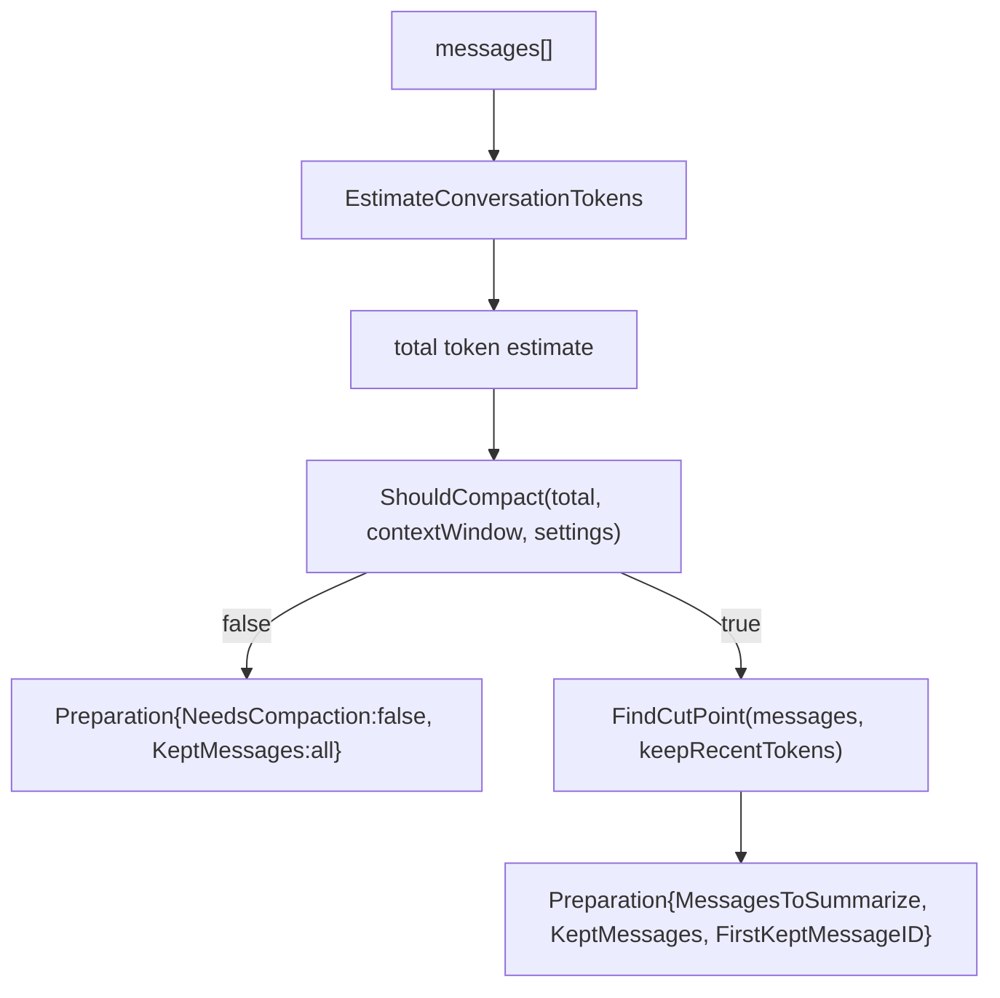
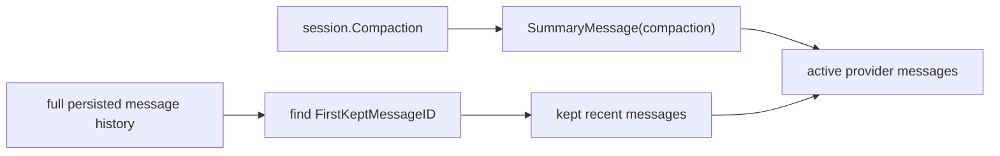

# Compaction Architecture

`internal/compaction` is the runtime planning layer for context compaction.

It does not execute provider calls and it does not persist compaction artifacts directly. Its job is to answer:

- how large is the active conversation context
- whether compaction should trigger
- where the cut point should be
- what older messages should be summarized
- what active provider view should be reconstructed after a compaction artifact exists

This keeps compaction logic provider-agnostic and testable before it is wired into the agent loop.

## Package Position

`internal/compaction` currently depends on:

- `internal/conversation`
- `internal/session`

It must not depend on:

- provider implementations
- SQLite details
- CLI rendering
- app-layer orchestration

The agent runtime will call into this package, then use the provider boundary to actually generate summaries, and finally persist the resulting compaction artifact through the session store.

## High-Level Flow

## Current Responsibilities

The current package owns:

- token estimation for normalized conversation messages
- threshold checks from `context_window - reserve_tokens`
- cut-point selection anchored to user-turn boundaries
- preparation of:
  - `MessagesToSummarize`
  - `KeptMessages`
  - `FirstKeptMessageID`
- reconstruction of the active provider context from:
  - latest compaction artifact
  - kept recent messages
- serialization of messages into a summarization-safe text format

## What It Does Not Own

This package does not:

- call the provider
- build provider HTTP payloads
- persist compaction artifacts
- emit agent events
- render CLI notices

Those belong to:

- `internal/agent`
- `internal/provider`
- `internal/session` / `internal/storage/sqlite`
- `internal/app`

## Runtime Planning Model

The key idea is:

- summarize old context
- keep recent context verbatim
- make the cut point deterministic and easy to test

## Active Context Reconstruction

After a compaction artifact exists, the provider should not receive the full historical conversation.

It should receive:

1. a synthetic summary message built from the compaction artifact
2. the kept messages from `FirstKeptMessageID` onward

That reconstruction is handled by `BuildActiveMessages(...)`.

This is the architectural reason compaction artifacts are explicit session records rather than invisible in-memory rewrites.

## Cut-Point Rule

The current implementation deliberately uses a simple rule:

- walk backward from the newest message
- accumulate estimated tokens
- when the `keep_recent_tokens` budget is crossed, move the cut point back to the nearest user message

This means:

- recent context remains intact
- compaction is aligned to a user-turn boundary
- tool results do not get split off arbitrarily from later context

This is narrower than pi-mono’s split-turn handling and is intentional for the first implementation slice.

## Summary Serialization

`SerializeForSummarization(...)` converts normalized `conversation.Message` values into plain text markers such as:

- `[USER]: ...`
- `[ASSISTANT]: ...`
- `tool_request(name): ...`
- `tool_response: ...`
- `system_notification(level): ...`

This is done so the summarizer sees an explicit transcript to summarize rather than a live conversation to continue.

## Current Types

- `Settings`
  Controls `enabled`, `reserve_tokens`, and `keep_recent_tokens`.
- `CutPoint`
  The first kept message id and its index.
- `Preparation`
  The planning output for a pending compaction run.

Key functions:

- `DefaultSettings()`
- `EstimateMessageTokens(...)`
- `EstimateConversationTokens(...)`
- `ShouldCompact(...)`
- `FindCutPoint(...)`
- `Prepare(...)`
- `BuildActiveMessages(...)`
- `SummaryMessage(...)`
- `SerializeForSummarization(...)`

## Design Tradeoffs

### Why this is simpler than pi-mono

Current `goose-go` compaction planning does not yet support:

- split-turn compaction
- iterative summary updates
- branch summarization
- extension-defined compaction
- cumulative file-operation tracking

That is intentional. The first goal is a correct, explicit checkpoint model that fits the existing Go runtime.

### Why this is more explicit than Goose

Upstream Goose mostly rewrites conversation visibility state in-place.

This package is designed around explicit compaction artifacts and reconstructed active context instead. That fits:

- the event-driven runtime
- explicit traces
- resume/replay
- future TUI rendering

## Next Integration Step

The next implementation step is not more planner logic. It is:

1. add the summarization prompt and provider-backed summarizer
2. have `internal/agent` call this planner before provider turns
3. persist compaction artifacts through the session store
4. emit compaction events into the existing event stream

At that point, `internal/compaction` remains the pure planning layer and `internal/agent` remains the orchestration layer.
