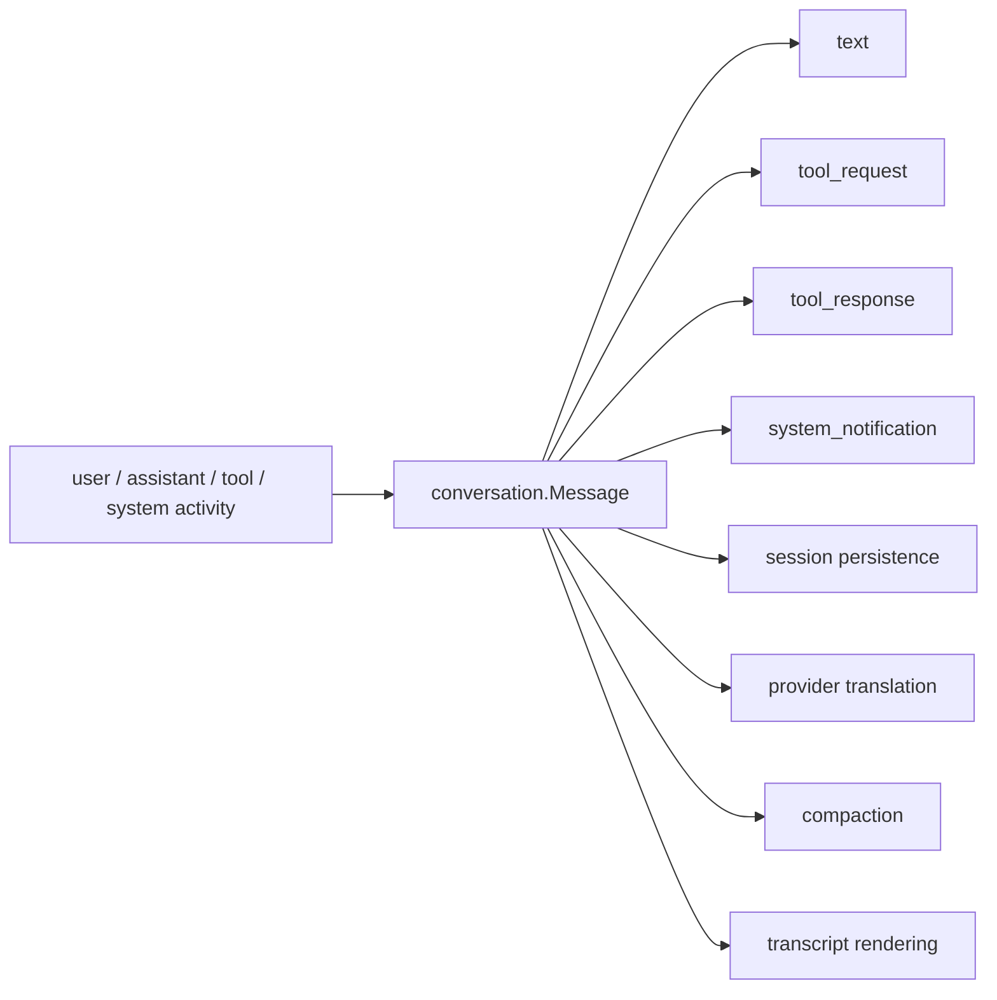

# Conversation Architecture

`internal/conversation` defines the normalized message model shared across the runtime.

It is the shape that agent, provider, storage, compaction, and UI code agree on before any provider-specific or storage-specific translation happens.

## Code Map

- `Conversation`
  Ordered message list used as the persisted and replayable source of truth.
- `Message`
  One timestamped message with a role and structured content blocks.
- `Content`
  Tagged union for text, tool requests, tool responses, and system notifications.
- ID helpers
  Local message identifier generation for persisted runtime state.

## Message Model

## Boundaries

- this package owns normalized conversation types and validation rules
- it must not know about provider wire DTOs, SQL schema details, or terminal rendering state
- callers should persist and replay conversation data through these types instead of reconstructing ad hoc prompts

## Cross-Cutting Concerns

- replay: persisted sessions depend on this model being stable enough to reconstruct prior runs
- tool use: tool requests and tool responses are first-class content types, not hidden string conventions
- compaction: summaries and active-context rebuilding operate over this normalized structure
- provider independence: providers translate to and from this model rather than leaking API-specific item types inward

## Current Constraints

- the content model is intentionally narrow and optimized for the current terminal runtime
- richer multimodal or provider-specific content should extend the normalized types deliberately, not bypass them
