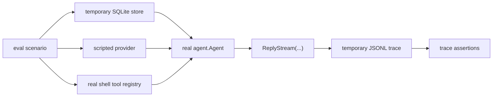
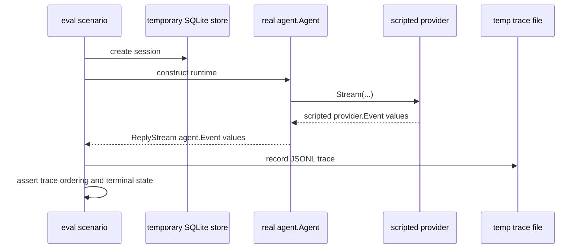

# Eval Harness Architecture

`internal/evals` holds the deterministic regression harness for the `goose-go` runtime.

It exists to test the runtime as an agent system, not just as a set of isolated packages.

## Purpose

The eval harness exercises the real runtime boundaries:

- `internal/agent`
- `internal/session`
- `internal/storage/sqlite`
- `internal/tools`

It replaces only the live provider with scripted responses so scenarios stay deterministic and cheap to run.

The harness is designed to answer questions like:

- does a tool-using run emit the expected event lifecycle
- does an approval-required run stop in the right state
- does a resumed session preserve prior context
- does max-turn termination surface correctly

It does not try to evaluate model quality or provider correctness against the real network.

## Package Position

`internal/evals` is intentionally outside the production runtime path.

It may depend on runtime packages, but production packages must not depend on it. That boundary is enforced by `internal/archcheck`.

## Architecture Diagram



## Runtime Flow



## Core Design

The harness makes four deliberate choices:

1. Use the real runtime.
   The agent loop, session store, SQLite backend, and shell tool are real.

2. Script the provider.
   The provider is the only replaced component so scenarios remain deterministic.

3. Assert on normalized agent events.
   The harness checks runtime facts such as `tool_call_detected` or `run_completed`, not terminal text and not raw provider SSE.

4. Record traces before asserting.
   Each scenario writes a JSONL trace and then asserts on the stored trace records. This mirrors how the app layer now records live traces from real runs.

## Current Scenario Set

The harness currently covers:

- plain chat completion
- tool round-trip
- approval deny path
- interrupted run
- resumed session
- awaiting approval with no approver
- max-turn termination

These all live in [evals_test.go](/Users/rex/projects/goose-go/internal/evals/evals_test.go).

## Main Pieces

- `scenario`
  Describes the prompt, scripted provider, approval mode, approver, and optional max-turn override.

- `runScenario(...)`
  Builds a temporary runtime and runs one scenario.

- `drainTrace(...)`
  Consumes `ReplyStream(...)`, writes a temporary JSONL trace, then reads it back into `traceRecord` values.

- assertion helpers
  Functions such as `assertContainsTypes(...)`, `assertNotContainsTypes(...)`, and `assertFinalType(...)`.

## What The Harness Does Not Cover

The current harness does not:

- call the real Codex backend
- validate output wording quality
- test desktop or server UI
- benchmark latency
- replace provider-specific unit tests

It is a runtime-behavior harness, not an LLM benchmark suite.

## Relationship To `make eval`

`make eval` currently runs:

```sh
go test ./internal/evals -v
```

So the public repo entrypoint is stable, but the harness itself is still implemented as Go tests.

## Next Likely Growth

The next eval growth areas are likely:

- richer CLI-facing smoke integration
- provider-smoke failure-path coverage
- compaction scenarios
- broader trace-order assertions

Those should extend this package-local document rather than leaving the design in chat context.
