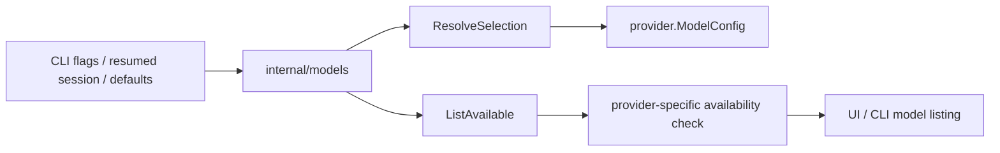

# Models Architecture

`internal/models` is the runtime identity registry for providers and models.

It gives the rest of the system one place to answer:

- what providers exist
- what models they expose
- which model is the default
- whether a configured model is currently available to the user

## Code Map

- provider and model specs
  Stable catalog entries for provider ids, display names, defaults, and context windows.
- selection helpers
  Resolve provider/model pairs and convert them into normalized provider config.
- availability resolver
  Checks whether a provider is usable in the current environment and explains why not.

## Selection Flow

## Boundaries

- this package owns provider/model identity, not provider transport
- it may depend on narrow auth availability checks when availability is environment-dependent
- it must not contain TUI widget logic, agent orchestration, or provider HTTP behavior

## Cross-Cutting Concerns

- selection persistence: resumed sessions reuse provider/model identity captured at the session boundary
- availability reporting: UI and CLI surfaces need stable explanations for unavailable models without probing live provider streams
- token budgeting: model specs carry context-window data used elsewhere for compaction and runtime limits

## Current Constraints

- the registry is intentionally static and small
- the first availability check is Codex-auth based and not yet a generic provider capability system
