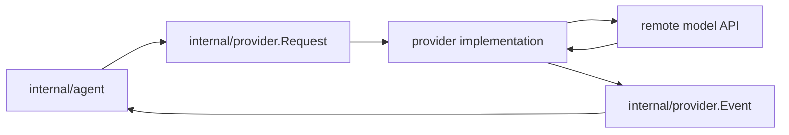

# Provider Architecture

`internal/provider` defines the normalized model-facing boundary for the runtime.

It exists so the agent loop can talk to models through one request/event contract while concrete providers keep their wire formats private.

## Code Map

- `Provider`
  Streaming interface used by the agent runtime.
- `Request`
  Normalized input containing system prompt, conversation messages, tool definitions, session id, and model config.
- `Event`
  Normalized streaming output for deltas, final messages, usage, completion, and errors.
- `ModelConfig`
  Runtime model selection passed from `internal/models` into provider implementations.

Concrete implementations live in subpackages such as `internal/provider/openaicodex`.

## Boundary Flow

## Boundaries

- `internal/provider` owns the normalized contract, not transport details
- concrete provider packages may translate requests and streams, but they must not execute tools or manage sessions
- runtime packages should consume normalized events instead of raw SSE or HTTP responses

## Cross-Cutting Concerns

- streaming: the contract is event-oriented so CLI, traces, and TUI can consume the same runtime milestones
- tool calls: tool definitions and final assistant messages pass through this boundary in normalized form
- diagnostics: provider implementations can emit low-level errors, but user-facing categorization belongs above this layer

## Current Constraints

- the current contract is intentionally narrow and optimized for the first provider slice
- new provider capabilities should extend the normalized boundary only when they are needed across the runtime, not for one implementation alone
