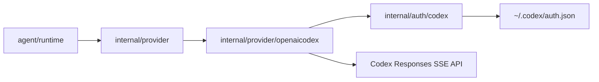
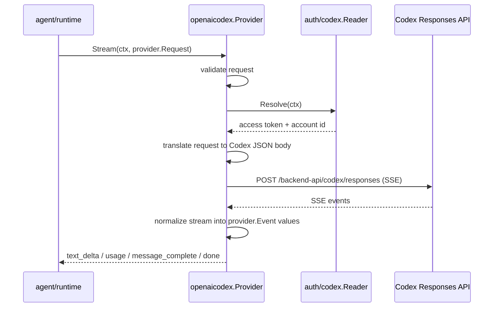
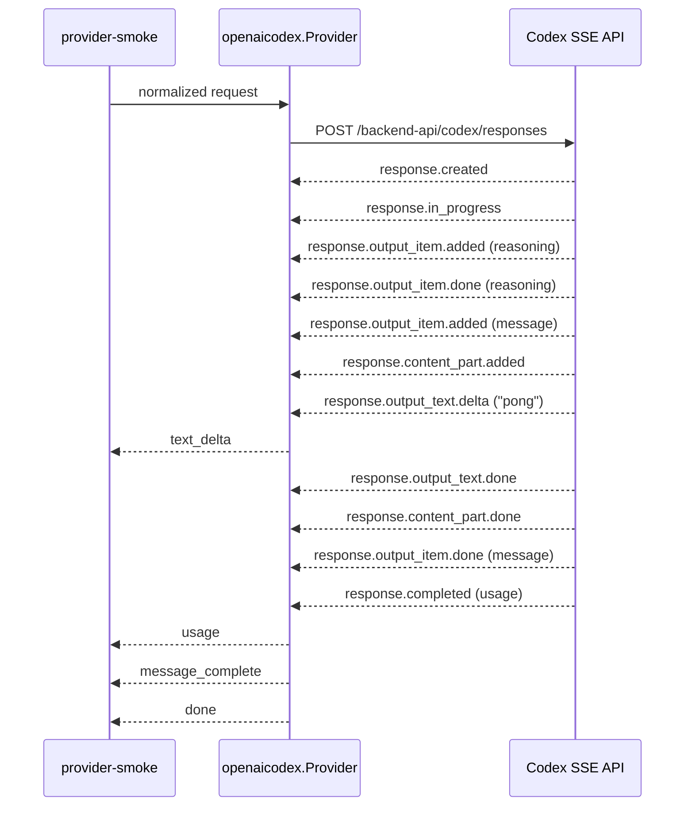

# OpenAI Codex Provider

This document describes the high-level architecture of `internal/provider/openaicodex`.

It exists so a fresh agent can understand how the first provider works without reading the implementation first.

## Purpose

`internal/provider/openaicodex` is the first concrete implementation of the normalized provider boundary in `goose-go`.

Its job is narrow:

- accept a normalized `provider.Request`
- obtain valid Codex subscription credentials
- translate the request into Codex Responses API wire format
- stream SSE events from the Codex backend
- convert those SSE events back into normalized `provider.Event` values

It does not:

- execute tools
- manage sessions
- build prompts
- own the agent loop
- know about SQLite storage internals

## Package Position

`openaicodex` sits between the runtime and the Codex backend.

## Main Flow

## Observed Smoke Sequence

The following sequence was observed from a real `go run ./cmd/goose-go provider-smoke --debug` run against local Codex auth on 2026-03-08.

Observed normalized output from that run:

- `text_delta`: `pong`
- `usage`: `input_tokens=26`, `output_tokens=23`, `total_tokens=49`
- `message_complete`: assistant text message `pong`
- `done`

Observed raw SSE lifecycle from that run:

- `response.created`
- `response.in_progress`
- `response.output_item.added` for `reasoning`
- `response.output_item.done` for `reasoning`
- `response.output_item.added` for `message`
- `response.content_part.added`
- `response.output_text.delta`
- `response.output_text.done`
- `response.content_part.done`
- `response.output_item.done` for `message`
- `response.completed`

Not every raw event currently maps to a normalized provider event. The current provider normalizes the events that matter to the runtime and ignores intermediate lifecycle noise.

## Internal Responsibilities

The package currently has four responsibilities.

### 1. Request translation

`provider.Request` is converted into the Codex Responses request body:

- `SystemPrompt` -> `instructions`
- normalized conversation messages -> `input`
- normalized tool definitions -> `tools`
- `SessionID` -> `prompt_cache_key`
- model settings -> model-specific request fields

The translation is intentionally local to this package. Codex wire DTOs must not leak into `internal/provider` or the runtime.

### 2. Auth header construction

The provider does not parse `~/.codex/auth.json` itself. It delegates to `internal/auth/codex`, which returns normalized credentials.

The provider then builds the Codex-specific headers:

- `Authorization: Bearer ...`
- `chatgpt-account-id: ...`
- `OpenAI-Beta: responses=experimental`
- `accept: text/event-stream`
- `content-type: application/json`

### 3. SSE parsing

The provider uses SSE only in the current slice.

It reads `data:` lines, groups them into complete SSE messages, parses the event JSON, and ignores non-data noise.

### 4. Event normalization

Codex-specific SSE events are mapped into normalized `provider.Event` values:

- text/refusal deltas -> `text_delta`
- completed response usage -> `usage`
- completed output items -> final assistant `conversation.Message`
- stream completion -> `done`
- provider/API failure -> `error`

The runtime should be able to consume these events without knowing anything about Codex event names.

## Current Output Shape

The provider currently normalizes two main output categories:

- assistant text content
- tool-call requests encoded as `conversation.ContentTypeToolRequest` in the final assistant message

This is enough for the current milestone, but the provider is still intentionally narrow.

## Current Constraints

The current `openaicodex` implementation is intentionally limited:

- SSE only
- no websocket transport
- no broader Responses surface beyond the current normalized event set
- no native login flow
- no keyring-backed credentials
- no runtime tool execution wiring yet

These constraints are deliberate. They keep the first provider slice legible and testable.

## Design Rules

When changing this provider, keep these rules intact:

- keep Codex/OpenAI wire structs private to this package
- keep auth-file parsing in `internal/auth/codex`
- keep normalized request and event types in `internal/provider`
- do not let storage or CLI concerns leak into this package
- update this document when the provider shape changes materially

## Next Likely Changes

The next provider-level work will likely be one of:

- richer tool-call and output-item handling
- runtime smoke path proving the acceptance criterion end to end
- integration with the future tool runtime and agent loop

Those changes should extend this document rather than replacing it with chat-only context.
