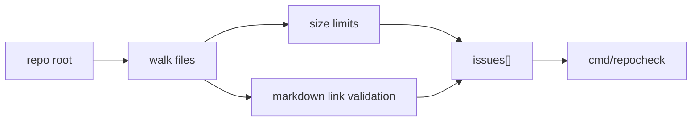

# Repo Check Architecture

`internal/repocheck` is the lightweight repository-hygiene checker.

It complements architecture-boundary checks by catching repo-wide issues that make the project harder for humans and agents to navigate.

## Code Map

- file walker
  Traverses the repo while skipping generated, vendor-like, or reference-only roots.
- size checks
  Applies line-count limits by file class.
- Markdown-link checks
  Resolves local Markdown links and reports missing targets.

## Check Flow

## Boundaries

- `internal/repocheck` owns repo hygiene checks, not package dependency enforcement
- it should stay deterministic and cheap enough for regular local use
- it must not grow into a hidden style-policy engine without the repo docs being updated

## Cross-Cutting Concerns

- agent legibility: oversized files and broken local docs hurt fresh-agent handoff quality
- docs as system of record: broken local links are treated as real repo quality failures
- scope control: the checker deliberately ignores deeper analyses such as clone detection for now

## Current Constraints

- the current checks are intentionally narrow: line counts and local Markdown links only
- future checks should remain explainable and directly tied to repo maintenance value
