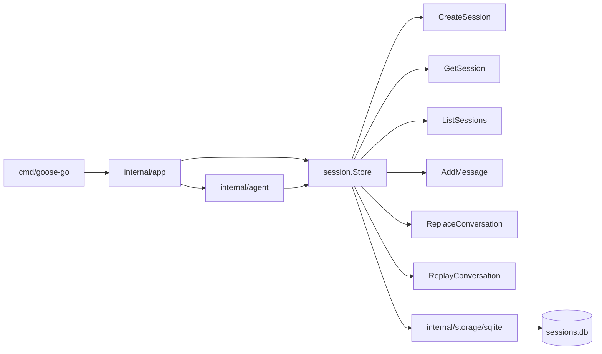
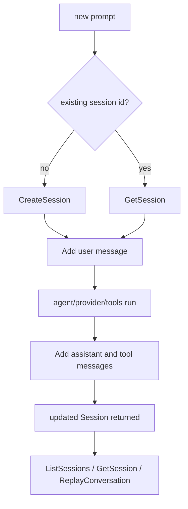
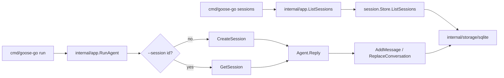

# Session Architecture

`internal/session` defines the domain-facing session contract for the runtime.

It owns:

- session metadata
- session summaries
- the persistence interface used by the agent and CLI
- resume and replay semantics at the domain boundary

It does not own SQLite queries, schema migration, provider logic, or terminal rendering.

## Package Position

`internal/session` is the persistence boundary used by:

- `internal/agent`
- `internal/app`

Concrete storage implementations live outside the package, currently in `internal/storage/sqlite`.

## Interface Flow


```

## Session Lifecycle



## CLI Session Flow


```

## Core Types

- `Session`
  Full persisted runtime state, including the structured conversation.
- `Summary`
  Lightweight metadata used for listing and session selection.
- `CreateParams`
  Input for creating a new session.
- `Store`
  The domain-facing persistence contract.

Current `Store` methods:

- `CreateSession`
- `GetSession`
- `ListSessions`
- `AddMessage`
- `ReplaceConversation`
- `ReplayConversation`

## Boundary Rules

- `internal/session` defines contracts, not storage implementation details.
- `internal/agent` and `internal/app` should depend on `session.Store`, not on SQLite directly.
- `internal/storage/sqlite` owns SQL queries, schema, and migrations.
- UI layers should not query SQLite directly when a session-store method exists.

## Current Implementation

The only concrete store today is `internal/storage/sqlite`.

That implementation:

- persists full conversations as JSON in SQLite
- exposes lightweight session summaries for CLI listing
- returns full `Session` records for runtime work
- keeps migrations in the storage layer, not in `internal/session`

## Near-Term Growth

Milestone 05 session ergonomics are now in place:

- `sessions` lists persisted session summaries
- `run --session <id>` resumes an existing session
- interrupts preserve persisted state and keep the store boundary intact

Later TUI work should keep using this boundary for session metadata and persisted conversation state, while using a separate live event stream for rendering.
