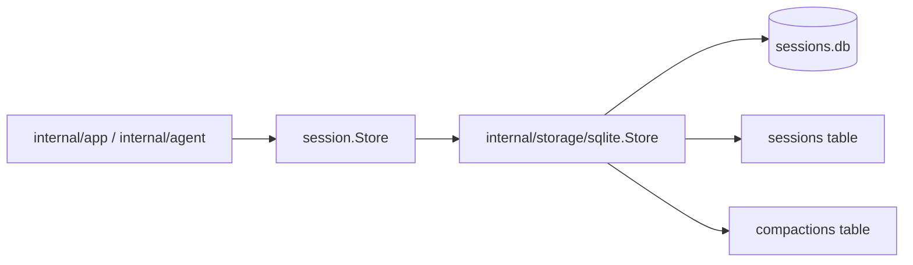

# SQLite Store Architecture

`internal/storage/sqlite` is the first concrete persistence implementation for the session boundary.

It translates normalized session and conversation state into SQLite rows while keeping SQL and migration details out of the domain packages.

## Code Map

- `Store`
  Concrete implementation of `session.Store`.
- migrations
  SQLite schema evolution for sessions, compactions, and persisted provider/model selection.
- session persistence
  Create, list, load, and update session records.
- conversation persistence
  Stores normalized conversation state as JSON.
- compaction persistence
  Stores explicit compaction artifacts keyed by session.

## Persistence Flow

## Boundaries

- this package owns SQL, migrations, and row-to-domain translation
- it must not own agent orchestration, provider logic, or tool execution
- callers should use the `session.Store` boundary rather than reaching into SQLite directly

## Cross-Cutting Concerns

- replay: full normalized conversations are persisted so runs can be resumed without provider-specific reconstruction
- compaction: explicit compaction artifacts preserve both history and the active-context cut point
- runtime identity: provider/model selection is persisted with the session so resumes can stay consistent

## Current Constraints

- SQLite is the only storage backend today
- conversations are stored as JSON blobs rather than heavily normalized relational rows
- schema evolution should remain simple and migration-driven while the runtime surface is still narrow
