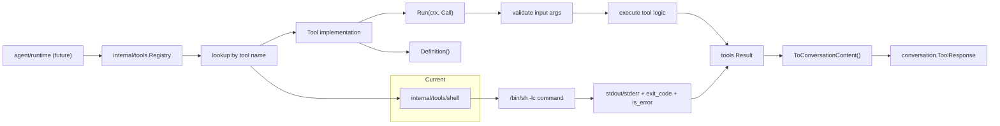

# Tools Architecture

`internal/tools` is the normalized runtime boundary for local tool execution.

It exists to give the future agent loop a stable, provider-agnostic way to:

- list available tools
- validate tool calls
- execute tools by name
- return structured results that can be appended back into the conversation

## Package Position

`internal/tools` owns the tool contract and registry.
Concrete implementations live under subpackages such as `internal/tools/shell`.
The package must stay independent from provider HTTP formats and storage implementations.

## Runtime Flow

## Core Types

- `Tool`
  The runtime contract. Each tool exposes metadata through `Definition()` and executes through `Run(ctx, Call)`.
- `Definition`
  The tool name, description, and JSON schema-like input metadata exposed to the runtime and later to the provider layer.
- `Call`
  The normalized invocation shape. It carries the tool name and raw JSON arguments.
- `Result`
  The normalized output shape. It carries structured data plus a conversion path back into conversation content.
- `Registry`
  The in-process index of available tools. It owns registration, lookup, listing, and dispatch by tool name.

## Current Implementation

The first concrete tool is `internal/tools/shell`.

It intentionally stays narrow:

- local execution only
- synchronous execution
- `/bin/sh -lc` command dispatch
- structured result with stdout, stderr, exit code, and error state

This establishes the result shape and execution path for later tools such as `write`, `edit`, and `tree`.

## Boundary Rules

- `internal/tools` must not depend on provider implementations.
- Tool implementations must not know about provider wire formats.
- Tool execution results must be normalized before they leave the tools layer.
- Storage concerns stay outside the tools package.
- The agent loop should orchestrate tools, not reimplement tool validation or dispatch logic.

## Near-Term Growth

The next planned tools are:

- `write`
- `edit`
- `tree`

They should follow the same pattern:

- declare a stable `Definition`
- validate a normalized `Call`
- execute locally
- return a structured `Result`

The goal for Milestone 03 is not tool breadth. The goal is to establish one clean tool runtime that the later agent loop can rely on without redesign.
