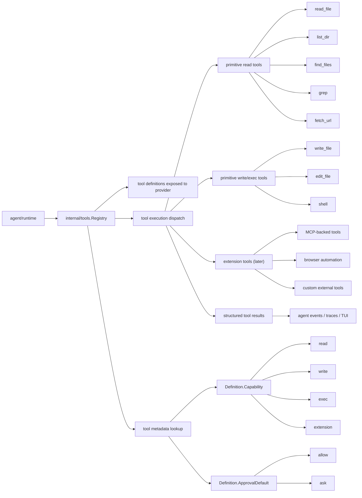

# Tools Architecture

`internal/tools` is the normalized runtime boundary for local tool execution.

It exists to give the future agent loop a stable, provider-agnostic way to:

- list available tools
- validate tool calls
- execute tools by name
- return structured results that can be appended back into the conversation

## Package Position

`internal/tools` owns the tool contract and registry.
Concrete implementations live under subpackages such as `internal/tools/shell`.
The package must stay independent from provider HTTP formats and storage implementations.

## Runtime Flow

## Core Types

- `Tool`
  The runtime contract. Each tool exposes metadata through `Definition()` and executes through `Run(ctx, Call)`.
- `Definition`
  The tool name, description, input schema, capability class, and default approval policy exposed to the runtime and later to the provider layer.
- `Call`
  The normalized invocation shape. It carries the tool name, raw JSON arguments, and runtime execution defaults such as the session working directory.
- `Result`
  The normalized output shape. It carries structured data plus a conversion path back into conversation content.
- `Registry`
  The in-process index of available tools. It owns registration, lookup, listing, metadata access, and dispatch by tool name.

## Capability Metadata

Capability metadata is attached directly to each tool definition. It is not a separate registry or policy service.

Current metadata model:

- `Definition.Capability`
  Classifies the tool as `read`, `write`, `exec`, or later `extension`.
- `Definition.ApprovalDefault`
  Declares whether the tool should default to `allow` or `ask` when the runtime is in approval mode.

This keeps the source of truth next to the tool implementation:

- the concrete tool returns its `Definition()`
- the registry stores that definition alongside the tool
- the agent reads the stored definition when deciding approval behavior in approval mode

The first shipped example is `shell`, which is registered as:

- capability: `exec`
- approval default: `ask`

## Current Implementation

The first concrete tools are:

- `internal/tools/fetchurl`
- `internal/tools/findfiles`
- `internal/tools/grep`
- `internal/tools/listdir`
- `internal/tools/readfile`
- `internal/tools/shell`

The primitive read-tool baseline is now in place:

- `fetch_url`
  bounded read-only HTTP fetch for docs and simple web pages
- `find_files`
  recursive filename search with glob-or-substring matching
- `grep`
  recursive text search with regular expressions
- `list_dir`
  directory listing with bounded entry counts
- `read_file`
  bounded UTF-8 file reads with truncation metadata

`shell` stays intentionally narrow:

- local execution only
- synchronous execution
- `/bin/sh -lc` command dispatch
- default execution in the session working directory when the model does not provide `working_dir`
- structured result with stdout, stderr, exit code, and error state
- capability metadata of `exec + ask`

Together they establish both sides of the capability model:

- read tools can default to autonomous execution
- exec tools stay explicit and approval-gated

## Boundary Rules

- `internal/tools` must not depend on provider implementations.
- Tool implementations must not know about provider wire formats.
- Tool execution results must be normalized before they leave the tools layer.
- Storage concerns stay outside the tools package.
- The agent loop should orchestrate tools, not reimplement tool validation or dispatch logic.
- Permission policy should be derived from tool metadata, not inferred from shell command text or tool names elsewhere in the runtime.

## Near-Term Growth

The next planned tools are:

- `write_file`
- `edit_file`

They should follow the same pattern:

- declare a stable `Definition`
- declare explicit capability and approval metadata
- validate a normalized `Call`
- execute locally
- return a structured `Result`

The goal is one clean tool runtime that the agent can rely on without hidden policy tables or ad hoc permission rules.
