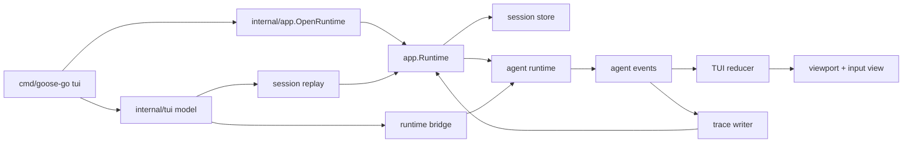
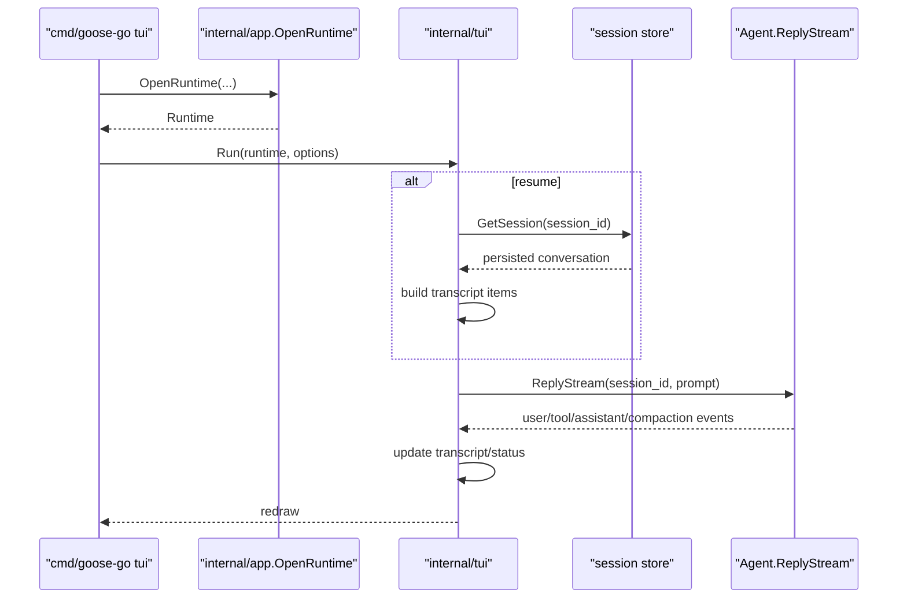
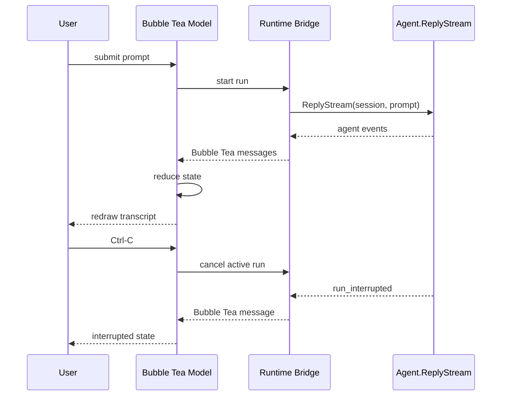

# TUI Architecture

## Role

`internal/tui` is the Bubble Tea frontend over the existing headless runtime.

It does not own provider logic, tool execution, or session persistence rules. It owns:

- Bubble Tea application lifecycle
- TUI state reduction
- transcript rendering
- input handling
- local slash-command handling for runtime metadata, in-TUI model selection, and display toggles
- runtime event consumption
- interrupt wiring at the UI layer

## Current Stage

This package now contains the full Stage 1 MVP plus the first Stage 2 interaction slices:

- single-column layout
- transcript viewport
- text input composer
- submit/run flow
- resume by known session id
- live rendering from `ReplyStream(...)`
- grouped tool blocks plus compaction and failure notices
- debug-driven transcript verbosity, controlled entirely at the TUI layer
- interrupt of the active run
- registry-backed model selection through `/model`
- built-in dark/light theme selection through `--theme` and `/theme`
- recent-session entry through `/sessions` and `Ctrl-R`

Shell execution now requires approval on the TUI surface, and approval-required runs are handled inside the TUI through a focused approval panel backed by the existing approval continuation seam in `internal/agent` and `internal/app`.

## Runtime Diagram

## State Model

The root model keeps:

- session metadata
  - session id
  - working directory
- run state
  - idle
  - starting
  - running
  - interrupting
  - interrupted
  - completed
  - failed
  - awaiting approval
- transcript items
  - user
  - assistant
  - tool
  - system
  - error
  - live assistant buffer
- Bubble Tea components
  - `textinput.Model`
  - `viewport.Model`
- concurrency handles
  - async message channel
  - current run cancel func
  - current trace writer

## Stage 1 Command Flow

The implemented command path is:

## Event Flow

## Boundaries

`internal/tui` may:

- load a known session through the session/runtime boundary
- start runs through the runtime boundary
- replay persisted conversation for resume
- write traces through the provided recorder

`internal/tui` must not:

- talk to provider implementations directly
- execute tools directly
- inspect SQLite directly for live state
- parse provider-specific wire events

## Transcript Rules

The TUI keeps transcript items as structured state, not only as pre-rendered strings.

Rendering rules:

- user and assistant text render without explicit role prefixes; color and hierarchy distinguish them instead
- streamed assistant deltas accumulate in a temporary live buffer
- final assistant messages replace that live buffer to avoid duplicate output
- each tool call is grouped into one logical transcript block keyed by tool call id
- grouped tool items carry args, lifecycle status, and final output/error text
- tool activity now renders as subdued width-bounded transcript lines instead of bordered cards
- compact mode renders short summaries like `Reading [path]` without showing full args/output
- user, assistant, system, and error transcript lines are also width-bounded and wrapped inside the viewport instead of being emitted as oversized single lines
- compaction and failure events render as system notices

Current transcript replay behavior:

- persisted conversation is replayed from the session store on startup when `--session` is used
- live events are appended after replay
- the TUI does not read trace files to reconstruct history

## Current Constraints

- single-column only
- no command palette beyond local slash commands
- no side panels
- no SQLite polling for live updates

Current implementation detail:

- `Ctrl-C` quits when idle
- `Ctrl-C` or `Esc` interrupts the active run when running
- `Ctrl-D` quits only when idle
- `Ctrl-R` opens the recent-session picker when idle
- `PageUp` / `PageDown` scroll the transcript viewport without leaving the composer
- mouse wheel / trackpad scrolling now drives the transcript viewport directly
- `Home` / `End` jump to the top or bottom of transcript history
- the transcript only auto-follows new output when the viewport is already at the bottom; if the user scrolls up, new output does not yank the viewport back down
- `/help` lists the current local command surface
- `/session` reports current session metadata from TUI/runtime state
- `/new` resets the interactive surface to a fresh session state
- `/debug` toggles debug mode for the current TUI session
- `/theme` is handled locally in the TUI, opens a built-in theme picker, and updates only TUI presentation state
- shell-triggered approval-required runs open a focused approval panel with allow/deny actions
- `/model` is handled locally in the TUI, opens a registry-backed picker, and does not start a provider run
- `/sessions` is handled locally in the TUI, opens a recent-session picker, and loads the selected session through the runtime boundary
- the TUI root context is now long-lived and cancelable, not capped by a fixed 5-minute deadline
- TUI styling is now driven by semantic tokens in [theme/ARCHITECTURE.md](/Users/rex/projects/goose-go/internal/tui/theme/ARCHITECTURE.md) instead of scattered color literals

## Current Gaps

Remaining Stage 2 work:

1. richer command surfaces
2. interaction-surface polish
3. custom theme loading and hot reload

## Next Steps

The next TUI work stays in Stage 2:

1. richer command surfaces
2. interaction-surface polish
3. custom theme loading and hot reload
