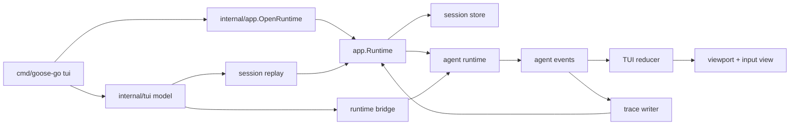
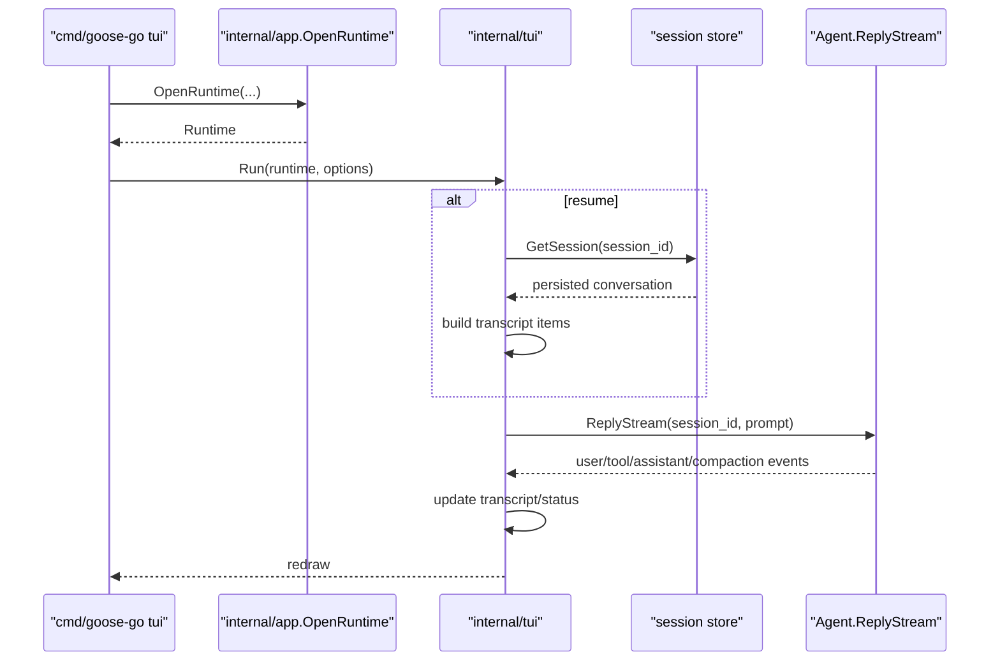
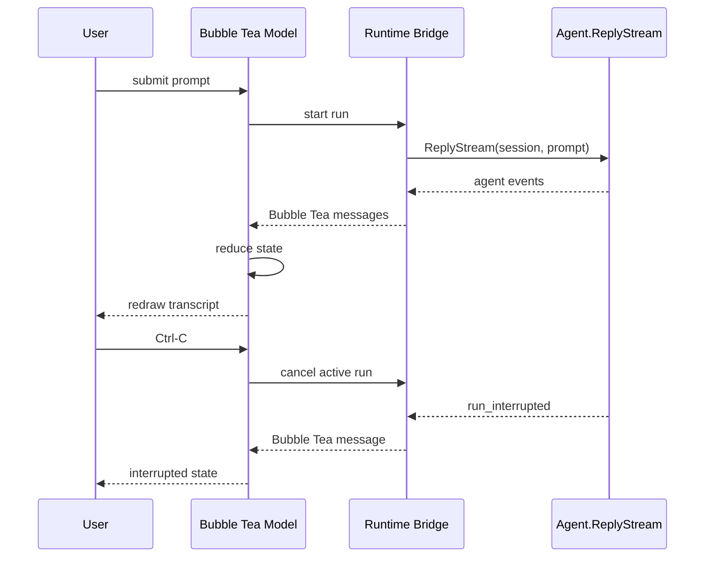

# TUI Architecture

## Role

`internal/tui` is the Bubble Tea frontend over the existing headless runtime.

It does not own provider logic, tool execution, or session persistence rules. It owns:

- Bubble Tea application lifecycle
- TUI state reduction
- transcript rendering
- input handling
- runtime event consumption
- interrupt wiring at the UI layer

## Current Stage

This package currently implements the Stage 1 MVP shape:

- single-column layout
- transcript viewport
- text input composer
- submit/run flow
- resume by known session id
- live rendering from `ReplyStream(...)`
- tool, compaction, and failure notices
- interrupt of the active run

Approval-required runs are surfaced read-only in Stage 1. Interactive approval UI is deferred.

## Runtime Diagram

## State Model

The root model keeps:

- session metadata
  - session id
  - working directory
- run state
  - idle
  - starting
  - running
  - interrupting
  - interrupted
  - completed
  - failed
  - awaiting approval
- transcript items
  - user
  - assistant
  - tool
  - system
  - error
  - live assistant buffer
- Bubble Tea components
  - `textinput.Model`
  - `viewport.Model`
- concurrency handles
  - async message channel
  - current run cancel func
  - current trace writer

## Stage 1 Command Flow

The implemented command path is:

## Event Flow

## Boundaries

`internal/tui` may:

- load a known session through the session/runtime boundary
- start runs through the runtime boundary
- replay persisted conversation for resume
- write traces through the provided recorder

`internal/tui` must not:

- talk to provider implementations directly
- execute tools directly
- inspect SQLite directly for live state
- parse provider-specific wire events

## Transcript Rules

The TUI keeps transcript items as structured state, not only as pre-rendered strings.

Rendering rules:

- user and assistant text render as role-prefixed transcript lines
- streamed assistant deltas accumulate in a temporary live buffer
- final assistant messages replace that live buffer to avoid duplicate output
- tool requests and tool results render as explicit transcript items
- compaction and failure events render as system notices

Current transcript replay behavior:

- persisted conversation is replayed from the session store on startup when `--session` is used
- live events are appended after replay
- the TUI does not read trace files to reconstruct history

## Stage 1 Constraints

- single-column only
- no interactive approval UI
- no session picker
- no slash commands
- no side panels
- no SQLite polling for live updates

Current implementation detail:

- `Ctrl-C` quits when idle
- `Ctrl-C` or `Esc` interrupts the active run when running
- `Ctrl-D` quits only when idle
- approval-required runs are surfaced as status plus a system notice

## Current Gaps

The initial scaffold is intentionally incomplete. Remaining Stage 1 work:

1. stronger scripted smoke coverage around run start, tool activity, and interrupt
2. manual TUI runbook in repo docs
3. UI stabilization around long transcripts and status presentation

## Next Steps

The next Stage 1 work after this initial scaffold is:

1. add stronger TUI smoke coverage around run start, tool activity, and interrupt
2. document a manual TUI runbook in the repo
3. then move to Stage 2 UX work only after the reducer and runtime bridge stabilize
