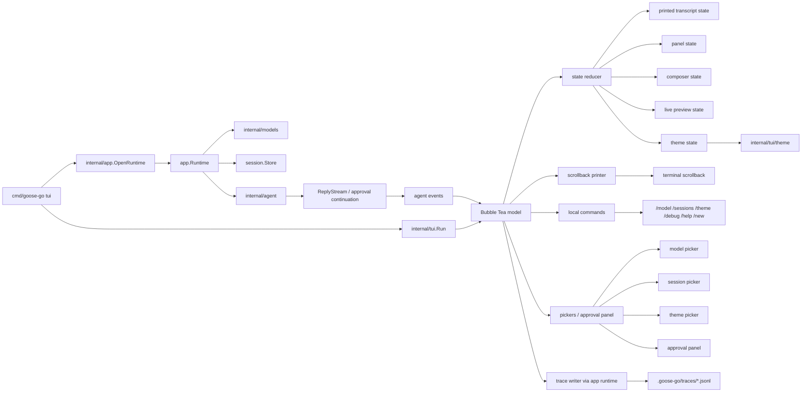
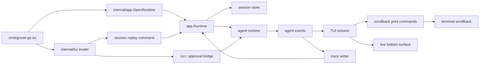

# TUI Architecture

## Role

`internal/tui` is the Bubble Tea frontend over the headless runtime.

It does not own provider logic, tool execution, or session persistence rules. It owns:

- Bubble Tea lifecycle
- TUI state reduction
- terminal-native transcript printing
- bottom control-surface rendering
- local slash-command handling
- approval, model, session, and theme panels
- runtime event consumption

## Current Stage

This package contains the Stage 1 MVP plus most Stage 2 interaction work:

- normal-screen Bubble Tea UI
- terminal-owned transcript scrollback
- text input composer
- status and metadata bars near the bottom
- live assistant preview while a run is active
- replay of persisted session history into terminal scrollback
- approval UI backed by the runtime approval seam
- model picker, session picker, and theme picker
- local commands such as `/help`, `/session`, `/model`, `/sessions`, `/theme`, `/debug`, and `/new`
- compact/debug transcript rendering modes
- markdown-aware assistant/system rendering

## Frontend Structure

Important correction:

- the TUI no longer owns transcript scrolling through a `viewport.Model`
- the terminal owns scrollback, wheel scrolling, and text selection
- Bubble Tea owns only the live bottom control surface and modal/picker panels

## Runtime Diagram

## State Model

The Bubble Tea model now keeps only live interactive state:

- session metadata
  - session id
  - working directory
- run state
  - idle
  - starting
  - running
  - interrupting
  - interrupted
  - completed
  - failed
  - awaiting approval
- composer state
  - `textinput.Model`
- panel state
  - approval
  - model picker
  - session picker
  - theme picker
- live preview state
  - in-progress assistant text
- active tool state
  - temporary grouped tool data needed to render a final tool result
- trace writer / cancel handles

The model does **not** own persistent transcript history anymore.

## Event To Output Rules

The reducer treats runtime events as facts and maps them into either:

- printed transcript output
- live preview updates
- bottom-surface state changes

Current rules:

- `user_message_persisted`
  - print the persisted user message into scrollback
- `provider_text_delta`
  - update only the bottom live assistant preview
- `assistant_message_complete`
  - clear the preview and print the finalized assistant message into scrollback
- `tool_call_detected`
  - print a compact tool activity line into scrollback
- `tool_message_persisted`
  - print the finalized compact/debug tool rendering into scrollback
- `approval_required`
  - open the approval panel in the bottom surface
- `run_completed`, `run_failed`, `run_interrupted`
  - update run status and print only the transcript-visible notices

## Replay And Resume

On startup with `--session <id>` or after `/sessions` selection:

1. load the persisted conversation through `internal/app`
2. rebuild transcript items from the session store
3. render those items with the same transcript renderer used for live output
4. print them into terminal scrollback
5. resume interaction on the same bottom control surface

So replay and live rendering share the same rendering path.

## Transcript Rules

Transcript rendering is still structured, but it is now print-oriented instead of viewport-oriented.

Rules:

- user messages render as subdued full-width bubbles
- assistant and system message content render through [markdown/ARCHITECTURE.md](/Users/rex/projects/goose-go/internal/tui/markdown/ARCHITECTURE.md)
- user and assistant text render without explicit role prefixes
- system and error output keep explicit labels
- tool activity uses grouped semantics but prints as subdued transcript lines instead of bordered cards
- compact mode prints short summaries
- debug mode prints full indented tool details
- all transcript rendering remains width-bounded before printing, so scrollback output does not rely on raw terminal wrapping of oversized lines

## Boundaries

`internal/tui` may:

- load or replay sessions through the runtime boundary
- start runs through the runtime boundary
- continue approval flows through the runtime boundary
- print transcript output based on normalized agent events
- write traces through the provided recorder

`internal/tui` must not:

- talk to provider implementations directly
- execute tools directly
- read SQLite directly for live state
- parse provider-specific wire events

## Current Interaction Model

- normal screen mode only
- no alt-screen
- no app-owned transcript viewport
- no Bubble Tea mouse capture by default
- terminal scrollback handles:
  - mouse wheel history
  - text selection/copy
  - terminal search
- pickers stay keyboard-driven
- `Ctrl-C` or `Esc` interrupts the active run
- `Ctrl-D` quits only when idle
- `Ctrl-R` opens the recent-session picker when idle

## Current Gaps

- transcript history is now terminal-owned, so there is no app-level scroll position to inspect or replay inside the reducer
- session/model/theme pickers are keyboard-driven only
- the command surface is useful but still small
- custom file-backed themes are not implemented yet
