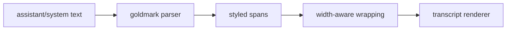

# Markdown Renderer Architecture

## Role

`internal/tui/markdown` renders inline markdown for transcript message content while leaving transcript layout ownership in `internal/tui`.

It owns:

- inline markdown parsing
- semantic markdown styling
- ANSI-safe width-aware wrapping for styled spans

It does not own:

- transcript spacing
- user bubble layout
- tool grouping
- panel rendering

## Flow

## Current Scope

- strong emphasis
- emphasis
- inline code
- links
- headings
- lists
- fenced code blocks

The transcript still owns outer layout. The markdown package only renders content blocks inside that layout.
