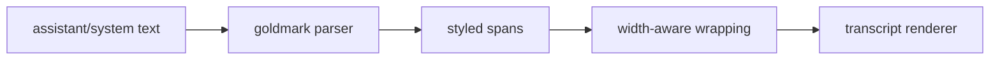

# Markdown Renderer Architecture

## Role

`internal/tui/markdown` renders inline markdown for transcript message content while leaving transcript layout ownership in `internal/tui`.

It owns:

- inline markdown parsing
- semantic markdown styling
- ANSI-safe width-aware wrapping for styled spans

It does not own:

- transcript spacing
- user bubble layout
- tool grouping
- panel rendering

## Code Map

- parser
  Turns markdown text into block and inline structures.
- styled spans
  Converts parsed content into theme-aware styled output.
- wrapping
  Preserves ANSI-safe width accounting before transcript output is printed.

## Flow

## Current Scope

- strong emphasis
- emphasis
- inline code
- links
- headings
- lists
- fenced code blocks

The transcript still owns outer layout. The markdown package only renders content blocks inside that layout.

## Boundaries

- this package owns markdown content rendering only
- transcript spacing, user bubbles, tool grouping, and panel composition stay in `internal/tui`

## Cross-Cutting Concerns

- width correctness: styling and wrapping must cooperate so normal-screen output stays readable in terminal scrollback
- theme integration: markdown styling should consume semantic theme decisions rather than embed raw presentation policy
- transcript consistency: assistant and system messages share one markdown rendering path instead of bespoke formatting rules
