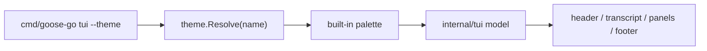

# TUI Theme Architecture

## Role

`internal/tui/theme` provides the semantic color system for the Bubble Tea frontend.

It keeps color and presentation tokens out of the main TUI reducer and renderer files.

## Current Scope

- built-in `dark` and `light` themes
- semantic tokens for header, footer, status, transcript, panels, and tool blocks
- startup theme selection via `goose-go tui --theme <name>`
- in-TUI theme switching through `/theme`

## Code Map

- theme resolution
  Maps a theme name to a built-in semantic palette.
- semantic tokens
  Stable presentation slots consumed by TUI renderers.
- TUI integration
  The main TUI model stores the active theme and applies tokens during rendering.

## Design Rules

- TUI components depend on semantic tokens, not raw color literals
- theme state affects only presentation, not runtime/provider behavior
- built-in themes are the current system of record; file-backed custom themes are still planned

## Flow

## Boundaries

- this package owns semantic presentation tokens, not runtime state or picker logic
- callers should depend on named tokens, not raw ANSI/color literals

## Cross-Cutting Concerns

- consistency: shared tokens keep transcript, panels, and status surfaces visually aligned
- theme switching: runtime behavior must remain unchanged when themes change
- extensibility: current built-ins are the stable seam future custom themes should plug into

## Next Steps

- add file-backed custom theme loading
- add validation for custom themes
- add hot reload for the active custom theme
