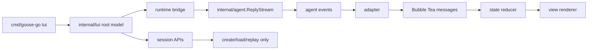

# 07c TUI Architecture

## Objective

Define the package boundaries, state model, and event-adapter shape for the Bubble Tea TUI before implementation grows.

This file is the system-of-record plan for how the TUI should connect to the existing runtime.

## Status

done

## Dependencies

- 06 Agent Event Stream Evals and Hardening

## Scope In

- TUI package boundaries
- state model
- event adapter model
- command/runtime integration shape
- Stage 1 vs Stage 2 split
- Bubble Tea integration model
- test strategy for reducer and runtime bridge

## Scope Out

- final UI polish
- provider-specific details
- implementation tickets for every single widget

## Proposed Package Shape

- `internal/tui`
  - Bubble Tea root model
  - top-level update/view loop
  - startup/shutdown
- `internal/tui/state`
  - normalized TUI state structs
  - reducer helpers
- `internal/tui/adapter`
  - conversion from agent events into Bubble Tea messages / state transitions
  - transcript-item builders
- `internal/tui/view`
  - transcript rendering helpers
  - status/footer rendering
  - layout helpers

The exact package split can stay smaller at first, but the conceptual boundaries should remain.

Recommendation:

- start with fewer files inside `internal/tui`
- keep the conceptual seams above
- split into subpackages only when the reducer/view boundary is stable

## Architecture Diagram

This is the core boundary:

- runtime owns behavior
- TUI owns state reduction and rendering
- session store is used for startup/resume, not as a live event bus

## State Model

The TUI should maintain at least:

- transcript state
  - structured transcript items
  - viewport cursor/offset
- composer/input state
  - current input text
  - submission/running status
- run state
  - idle
  - running
  - interrupted
  - failed
  - awaiting approval
- tool activity state
  - current tool call
  - latest tool result summaries
- session state
  - current session id
  - working directory
  - resume context metadata

Recommended transcript item kinds:

- user message
- assistant message
- assistant delta buffer
- tool requested
- tool running
- tool result
- system notice
- error notice
- compaction notice

## Event Adapter Model

The adapter should consume normalized `internal/agent` events and translate them into TUI messages.

The TUI should not interpret provider wire events directly.

Key inputs:

- `run_started`
- `user_message_persisted`
- `provider_text_delta`
- `assistant_message_complete`
- `tool_call_detected`
- `tool_execution_started`
- `tool_execution_finished`
- `tool_message_persisted`
- `compaction_started`
- `compaction_completed`
- `approval_required`
- `run_completed`
- `run_interrupted`
- `run_failed`

The adapter should also handle initial session replay separately from live stream events.

Recommendation:

- replay persisted history into transcript items first
- then append live stream updates
- do not try to synthesize replay from trace files

## Bubble Tea Integration Model

The Bubble Tea root model should use:

- `Init()`
  - startup commands
  - maybe initial session load
- `Update(msg tea.Msg)`
  - reducer/state transitions
  - command scheduling
- `View()`
  - layout assembly only

Recommended component choices:

- `bubbles/textinput`
  - composer
- `bubbles/viewport`
  - transcript scrolling
- `lipgloss`
  - layout, alignment, padding, colors

Avoid a large component tree in Stage 1. Keep most state in one root model first.

## Command Integration

The TUI should start runs through the same runtime boundaries already used by `internal/app`.

That likely means:

- create/load session
- call `Agent.ReplyStream(...)`
- read the stream in a goroutine
- forward normalized events into Bubble Tea messages

Recommendation:

- add a small TUI-focused app service rather than making the Bubble Tea model construct the whole runtime itself
- keep provider/store/runtime wiring outside the reducer

The TUI must not:

- read SQLite directly for live state
- call provider implementations directly
- execute tools directly

## Recommended Runtime Bridge Shape

One clean shape is:

- `tui.Runner`
  - owns current stream cancel func
  - starts runs
  - bridges stream events into a `chan tea.Msg`
- Bubble Tea model
  - receives `tea.Msg`
  - updates state
  - schedules commands

This keeps concurrency and cancellation out of the pure reducer path.

## Stage Split

Stage 1:

- transcript
- composer
- run/interrupt
- basic resume by id
- tool activity

Stage 2:

- approval interaction
- session picker
- richer tool rendering
- slash commands
- better navigation and status surfaces

## Testing Strategy

Stage 1 should have three layers:

1. reducer tests
- given TUI messages, assert state transitions

2. adapter tests
- given agent events, assert produced TUI messages/transcript items

3. smoke tests
- start a scripted run
- assert transcript/state transitions for:
  - plain chat
  - tool run
  - interrupt
  - resume

Stage 2 should add:

- approval interaction smoke tests
- session picker behavior tests
- richer tool panel rendering tests where practical

## Acceptance Criteria

- A fresh agent can implement Stage 1 from this file plus the existing runtime docs without reconstructing the architecture from chat.
- The package and state decisions are narrow enough to avoid a rewrite when Stage 2 starts.

## Open Questions

- Whether transcript state should store fully rendered strings or structured render items in Stage 1.

## Notes / Findings

- The initial Bubble Tea scaffold now exists under [internal/tui](/Users/rex/projects/goose-go/internal/tui).
- The package-local implementation doc is now [internal/tui/ARCHITECTURE.md](/Users/rex/projects/goose-go/internal/tui/ARCHITECTURE.md).
- The current implementation kept the package physically small while following the architecture in this plan:
  - one root model
  - one runtime bridge
  - structured transcript items
  - shared runtime/session setup from `internal/app`

## Decisions

- Bubble Tea is the selected TUI stack.
- Stage 1 will not include interactive approval UI.
- Stage 1 should stay single-column and event-driven.
